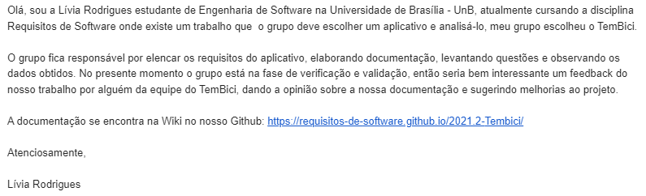

# Validação Informal
## Versionamento
 
| Versão | Data | Modificação | Autor |
|-|-|:-:|:-:|
| 1.0 | 23/03/2022 | Criação do Documento | Lívia Rodrigues |
| 1.1 | 08/04/2022 | Revisão e Adição de revisor | Luiz Hnerique |
| 1.2 | 09/04/2022 | Padronização de Legendas e Metodologias | Victor Eduardo |
| 1.1 | 25/04/2022 | Adição validação | Paulo Henrique, Luiz Hnerique |

*Tabela 1: versionamento*
 
## Introdução

&emsp;&emsp; Neste documento abordaremos a técnica validação, que é a confirmação de que o produto é aquele desejado pelo usuário, feito por proceso de elicitação de requisitos.

&emsp;&emsp; A validação informal é uma tarefa de leitura de descrições em linguagem natural e do uso dos usuários para identificar problemas na expressão dos requisitos. As estratégias para a validação têm em comum a falta de um apoio automatizado, e a excessiva dependência das habilidades analíticas dos leitores. O objetivo é buscar um feedback dos documentos elicitados pelo grupo por um funcionário do aplicativo em questão.

 
## Metodologia

&emsp;&emsp; Realizamos para a validação informal o contato por e-mail e mensagem de texto com a equipe técnica e funcionarios espécificos da empresa responsavel pelo aplicativo. 

Mensagem por e-mail:

*Imagem 1: Email enviado a equipe do Tembici*

*Autor: Livia Rodrigues*
 
## Resultados

&emsp;&emsp;Foi realizado primeiramente um contato por e-mail com a equipe técnica do Tembici onde não ouve resposta da empresa, continuamos a tentativa de contato por meio de mensagens de texto diretas para alguns funcionarios.

&emsp;&emsp; Como resultados, conseguimos realizar o contato e validação com um funcionário da Tembici:

- **Resposável pelo contato:** Paulo Henrique

- **Nome:** Vinicuis Sartonino

- **Cargo:** Engenheiro Backend

- **Forma de validação:** Por meio de uma reunião virtual e mensagens de texto.

- **Data:** 20/04/2022

- **Pontos validados:** A documentação como um todo foi validada, porém ouve um efoque na etapa de modelagem que foi elencada pela equipe como um ponto de maior atenção.

- **Feedbacks:**
    - **Positivos:**
        
 1 - O profissinal que analisou o trabalho elogiou a qualidade e consistência dos artafetos, validando que estavam de acordo com o aplicativo. 

    - **Melhorias:**
        
 1 - Foram elevantados alguns erros de português ao longos dos artefatos.

        
        
 2 - Casos de Uso - "Acredito que poderia ter um artefato focado ao usuário que já possua um plano".

        
 3 - Citar fontos de outro trabalhos consultados apenas nas refêrencias.".

        
 3 - Citar fontos de outro trabalhos consultados apenas nas refêrencias com a data que foi acessado.

        
 4 - NFR Framewokr - Poderia ter mais referências, foi utilizado apenas uma.

&emsp;&emsp; Os feedback recebidos foram analisados e priorizados juntamente as demais correções solitadas nos pontos de controle. 

 
## Referências

 SERRANO, Maurício; SERRANO, Milene; Requisitos - Aula 20. Acesso em: 23 de Março de 2022. 

