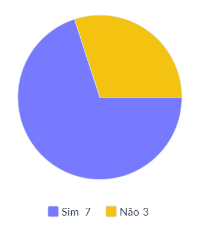

# Verificação Especificação Suplementar
## Versionamento

| Versão | Data | Modificação | Autor |
|-|-|:-:|:-:|
| 1.0 | 18/03/2022 | Criação do artefato | Victor Eduardo |
| 1.1 | 08/04/2022 | Revisão e Adição de revisor | Luiz Hnerique |
| 1.2 | 09/04/2022 | Padronização de Legendas e Metodologias | Victor Eduardo |

*Tabela 1: versionamento*

## Introdução

&emsp;&emsp;Tendo como base o projeto <a href="https://requisitos-de-software.github.io/2021.1-TesouroDireto/verificacao_suplementar/">Tesouro Direto</a> realizado por alunos da disciplina em semestres passados, e com o material [1], disponibilizados pelo professor para estudo, foi possível fazer a verificação do documento buscando a máxima assertividade na realização desta atividade, que tem como finalidade revisar o documento de <a href="https://requisitos-de-software.github.io/2021.2-Tembici/modelagem/especificacao_suplementar/">Especificação Suplementar</a> deste projeto e apontar análises e possíveis pontos de melhora.

## Metodologia

&emsp;&emsp;Usando como método a Inspeção, onde o objetivo é encontrar problemas no documento para avaliar se está de acordo com o modelo e com o que se espera [1], um checklist foi criado para a Especificação Suplementar. Artefato feito pelo integrante do grupo Victor Eduardo.

## Resultados
### Legenda
- ✅: Sim
- ❌: Não

| Item | Resposta |
|-|:-:|
| O documento está no formato FURPS+ |✅|
| Há rastreabilidade dos requisitos |❌|
| Há os links para os léxicos |❌|
| O documento especifíca interação e aprendizagem, na Usabilidade |✅|
| O documento especifíca itens padronizados e facilidade de memorização, na Usabilidade	|✅|
| O documento especifíca sobre armazenamento no app, na Performace |✅|
| O documento especifíca a transparência de dados, na Confiabilidade? |✅|
| O documento específica sobre os dispositivos suportados, na Suportabilidade |✅|
| O documento especifíca a testabilidade, na Suportabilidade |❌|
| O documento especifíca os Requisitos de Licenciamento	|✅|

*Tabela 2: Estrutura do checklist da Especificação Suplementar*

### Conclusão

&emsp;&emsp;O artefato está adequado a seu projeto, cumprindo àquilo que se propõe a resolver, necessitando apenas de algumas alterações e adições para que haja uma maior rastreabilidade no projeto ao relacionar os requisitos citados nesse documento.

  
*Imagem 1 - Gráfico do resultado do checklist realizado*  

*Autor: Luiz Henrique*

## Referências 

[1] - SERRANO, Maurício; SERRANO, Milene; Requisitos - Aula 23. Acesso em: 18 de Março dee 2022. 

