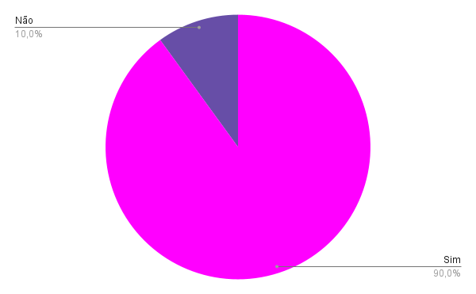
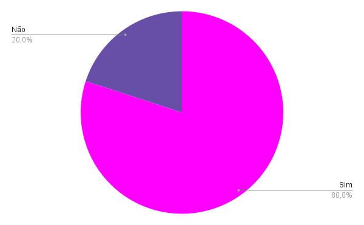
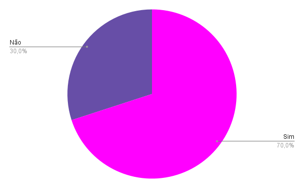

# Verificação das Histórias de Usuário

### Histórico de versão 

| Versão | Data | Modificação | Autor |
|-|-|:-:|:-:|
| 1.0 | 21/03/2022 | Criação do artefato | João Victor Batista |

 

## Introdução

&emsp;&emsp;Tendo como base o projeto <a href="https://requisitos-de-software.github.io/2021.1-TesouroDireto/verificacao_suplementar/">Tesouro Direto</a> realizado por alunos da disciplina em semestres passados, e com o material [1], disponibilizados pelo professor para estudo, foi possível fazer a verificação do documento buscando a máxima assertividade na realização desta atividade, que tem como finalidade revisar o documento de <a href="https://requisitos-de-software.github.io/2021.2-Tembici/modelagem/backlog/historias_de_usuario/">Histórias de Usuário</a> deste projeto e apontar análises e possíveis pontos de melhora.

## Metodologia

&emsp;&emsp;Usando o método de Inspeção, no qual o objetivo é identificar problemas no documento de modo a avaliar se ele está de acordo com o modelo e com o esperado do artefato [1], foi criado um checklist de critérios para a avaliação das Histórias de Usuário.

 

## Resultados
### Legenda
- ✅: Sim
- ❌: Não

 

#### US01 - Eu, como usuário(a), gostaria de realizar cadastro no sistema, para que minha conta fique registrada no sistema
| Item | Resposta |
| -- | :--: |
| A história de usuário possui feature, ID, descrição e critérios de aceitação? | ✅ |
| Histórias de usuário contendo atores, ação e objetivos? | ✅ |
| Os IDs da história de usuário possui alguma letra que identifica que é uma história? | ✅ |
| Os critérios de aceitação demonstram os critérios necessários para que a história de usuário seja realizada? | ✅ |
| Não existem erros de ortografia? | ❌ |
| A história de usuário é testável? | ✅ |
| A história de usuário é sucinta? | ✅ |
| A história de usuário é independente? | ✅ |
| A história de usuário agrega valor para o negócio? | ✅ |
| É possível estimar o tempo para desenvolver a história? | ✅ |

 

#### US02 - Eu, como usuário(a), gostaria de realizar login para que consiga acessar as funcionalidades
| Item | Resposta |
| -- | :--: |
| A história de usuário possui feature, ID, descrição e critérios de aceitação? | ✅ |
| Histórias de usuário contendo atores, ação e objetivos? | ✅ |
| Os IDs da história de usuário possui alguma letra que identifica que é uma história? | ✅ |
| Os critérios de aceitação demonstram os critérios necessários para que a história de usuário seja realizada? | ✅ |
| Existem erros de ortografia? | ❌ |
| A história de usuário é testável? | ✅ |
| A história de usuário é sucinta? | ✅ |
| A história de usuário é independente? | ✅ |
| A história de usuário agrega valor para o negócio? | ✅ |
| É possível estimar o tempo para desenvolver a história? | ✅ |

 

#### US03 - Eu, como usuário(a), gostaria de acessar minha conta por leitura facial e digital para facilitar o acesso
| Item | Resposta |
| -- | :--: |
| A história de usuário possui feature, ID, descrição e critérios de aceitação? | ✅ |
| Histórias de usuário contendo atores, ação e objetivos? | ✅ |
| Os IDs da história de usuário possui alguma letra que identifica que é uma história? | ✅ |
| Os critérios de aceitação demonstram os critérios necessários para que a história de usuário seja realizada? | ✅ |
| Existem erros de ortografia? | ❌ |
| A história de usuário é testável? | ✅ |
| A história de usuário é sucinta? | ✅ |
| A história de usuário é independente? | ✅ |
| A história de usuário agrega valor para o negócio? | ✅ |
| É possível estimar o tempo para desenvolver a história? | ✅ |

 

#### US04 - Eu, como usuário(a), gostaria de recuperar/alterar minha senha esquecida para que consiga acessar novamente
| Item | Resposta |
| -- | :--: |
| A história de usuário possui feature, ID, descrição e critérios de aceitação? | ✅ |
| Histórias de usuário contendo atores, ação e objetivos? | ✅ |
| Os IDs da história de usuário possui alguma letra que identifica que é uma história? | ✅ |
| Os critérios de aceitação demonstram os critérios necessários para que a história de usuário seja realizada? | ✅ |
| Existem erros de ortografia? | ❌ |
| A história de usuário é testável? | ✅ |
| A história de usuário é sucinta? | ✅ |
| A história de usuário é independente? | ✅ |
| A história de usuário agrega valor para o negócio? | ✅ |
| É possível estimar o tempo para desenvolver a história? | ✅ |

 

#### US05 - Eu, como usuário(a), gostaria de realizar logout para que consiga sair da conta
| Item | Resposta |
| -- | :--: |
| A história de usuário possui feature, ID, descrição e critérios de aceitação? | ✅ |
| Histórias de usuário contendo atores, ação e objetivos? | ✅ |
| Os IDs da história de usuário possui alguma letra que identifica que é uma história? | ✅ |
| Os critérios de aceitação demonstram os critérios necessários para que a história de usuário seja realizada? | ✅ |
| Existem erros de ortografia? | ❌ |
| A história de usuário é testável? | ✅ |
| A história de usuário é sucinta? | ✅ |
| A história de usuário é independente? | ✅ |
| A história de usuário agrega valor para o negócio? | ✅ |
| É possível estimar o tempo para desenvolver a história? | ✅ |

 

#### US06 - Eu, como usuário(a), gostaria de conhecer todos os planos oferecidos para escolher e adquirir algum e ter acesso as bicicletas
| Item | Resposta |
| -- | :--: |
| A história de usuário possui feature, ID, descrição e critérios de aceitação? | ✅ |
| Histórias de usuário contendo atores, ação e objetivos? | ✅ |
| Os IDs da história de usuário possui alguma letra que identifica que é uma história? | ✅ |
| Os critérios de aceitação demonstram os critérios necessários para que a história de usuário seja realizada? | ✅ |
| Existem erros de ortografia? | ❌ |
| A história de usuário é testável? | ✅ |
| A história de usuário é sucinta? | ✅ |
| A história de usuário é independente? | ✅ |
| A história de usuário agrega valor para o negócio? | ✅ |
| É possível estimar o tempo para desenvolver a história? | ✅ |

 

#### US07 - Eu, como usuário(a), gostaria de comprar um plano utilizando cupom promocional para ter desconto
| Item | Resposta |
| -- | :--: |
| A história de usuário possui feature, ID, descrição e critérios de aceitação? | ✅ |
| Histórias de usuário contendo atores, ação e objetivos?" | ✅ |
| Os IDs da história de usuário possui alguma letra que identifica que é uma história? | ✅ |
| Os critérios de aceitação demonstram os critérios necessários para que a história de usuário seja realizada? | ✅ |
| Existem erros de ortografia? | ❌ |
| A história de usuário é testável? | ✅ |
| A história de usuário é sucinta? | ✅ |
| A história de usuário é independente? | ✅ |
| A história de usuário agrega valor para o negócio? | ✅ |
| É possível estimar o tempo para desenvolver a história? | ✅ |

 

#### US08 - Eu, como usuário(a), gostaria de cadastrar meus cartões de crédito para conseguir comprar planos 
| Item | Resposta |
| -- | :--: |
| A história de usuário possui feature, ID, descrição e critérios de aceitação? | ✅ |
| Histórias de usuário contendo atores, ação e objetivos?" | ✅ |
| Os IDs da história de usuário possui alguma letra que identifica que é uma história? | ✅ |
| Os critérios de aceitação demonstram os critérios necessários para que a história de usuário seja realizada? | ✅ |
| Existem erros de ortografia? | ❌ |
| A história de usuário é testável? | ✅ |
| A história de usuário é sucinta? | ✅ |
| A história de usuário é independente? | ✅ |
| A história de usuário agrega valor para o negócio? | ✅ |
| É possível estimar o tempo para desenvolver a história? | ❌ |

 

#### US09 - Eu, como usuário(a), gostaria de ser cobrado pelo tempo de uso extrapolado e por viagens extras feitas para que possa pagar os custos adicionais
| Item | Resposta |
| -- | :--: |
| A história de usuário possui feature, ID, descrição e critérios de aceitação? | ✅ |
| Histórias de usuário contendo atores, ação e objetivos?" | ❌ |
| Os IDs da história de usuário possui alguma letra que identifica que é uma história? | ✅ |
| Os critérios de aceitação demonstram os critérios necessários para que a história de usuário seja realizada? | ✅ |
| Existem erros de ortografia? | ❌ |
| A história de usuário é testável? | ✅ |
| A história de usuário é sucinta? | ✅ |
| A história de usuário é independente? | ✅ |
| A história de usuário agrega valor para o negócio? | ✅ |
| É possível estimar o tempo para desenvolver a história? | ✅ |

 

#### US10 - Eu, como usuário(a), gostaria de visualizar um mapa da região selecionada para saber a localização de estações perto de mim
| Item | Resposta |
| -- | :--: |
| A história de usuário possui feature, ID, descrição e critérios de aceitação? | ✅ |
| Histórias de usuário contendo atores, ação e objetivos?" | ❌ |
| Os IDs da história de usuário possui alguma letra que identifica que é uma história? | ✅ |
| Os critérios de aceitação demonstram os critérios necessários para que a história de usuário seja realizada? | ❌ |
| Existem erros de ortografia? | ❌ |
| A história de usuário é testável? | ✅ |
| A história de usuário é sucinta? | ✅ |
| A história de usuário é independente? | ✅ |
| A história de usuário agrega valor para o negócio? | ✅ |
| É possível estimar o tempo para desenvolver a história? | ✅ |

 

#### US11 - Eu, como usuário(a), gostaria de visualizar a quantidade de bicicletas disponíveis em cada estação para saber onde posso retirar uma bicicleta
| Item | Resposta |
| -- | :--: |
| A história de usuário possui feature, ID, descrição e critérios de aceitação? | ✅ |
| Histórias de usuário contendo atores, ação e objetivos? | ❌ |
| Os IDs da história de usuário possui alguma letra que identifica que é uma história? | ✅ |
| Os critérios de aceitação demonstram os critérios necessários para que a história de usuário seja realizada?" | ❌ |
| Existem erros de ortografia? | ❌ |
| A história de usuário é testável? | ✅ |
| A história de usuário é sucinta? | ✅ |
| A história de usuário é independente? | ✅ |
| A história de usuário agrega valor para o negócio? | ✅ |
| É possível estimar o tempo para desenvolver a história? | ✅ |

 

#### US12 - Eu, como usuário(a), gostaria de visualizar minha localização atual para saber onde estou em tempo real
| Item | Resposta |
| -- | :--: |
| A história de usuário possui feature, ID, descrição e critérios de aceitação? | ✅ |
| Histórias de usuário contendo atores, ação e objetivos?" | ✅ |
| Os IDs da história de usuário possui alguma letra que identifica que é uma história? | ✅ |
| Os critérios de aceitação demonstram os critérios necessários para que a história de usuário seja realizada? | ❌ |
| Existem erros de ortografia? | ❌ |
| A história de usuário é testável? | ✅ |
| A história de usuário é sucinta? | ✅ |
| A história de usuário é independente? | ✅ |
| A história de usuário agrega valor para o negócio? | ✅ |
| É possível estimar o tempo para desenvolver a história? | ✅ |

 

#### US13 - Eu, como usuário(a), gostaria de buscar estações próximas a mim ou a meu destino
| Item | Resposta |
| -- | :--: |
| A história de usuário possui feature, ID, descrição e critérios de aceitação? | ✅ |
| Histórias de usuário contendo atores, ação e objetivos?" | ✅ |
| Os IDs da história de usuário possui alguma letra que identifica que é uma história? | ✅ |
| Os critérios de aceitação demonstram os critérios necessários para que a história de usuário seja realizada? | ❌ |
| Existem erros de ortografia? | ❌ |
| A história de usuário é testável? | ✅ |
| A história de usuário é sucinta? | ✅ |
| A história de usuário é independente? | ✅ |
| A história de usuário agrega valor para o negócio? | ✅ |
| É possível estimar o tempo para desenvolver a história? | ✅ |

 

#### US14 - Eu, como usuário(a), gostaria de retirar uma bicicleta em determinado local
| Item | Resposta |
| -- | :--: |
| A história de usuário possui feature, ID, descrição e critérios de aceitação? | ✅ |
| Histórias de usuário contendo atores, ação e objetivos?" | ✅ |
| Os IDs da história de usuário possui alguma letra que identifica que é uma história? | ✅ |
| Os critérios de aceitação demonstram os critérios necessários para que a história de usuário seja realizada? | ❌ |
| Existem erros de ortografia? | ✅ |
| A história de usuário é testável? | ✅ |
| A história de usuário é sucinta? | ✅ |
| A história de usuário é independente? | ✅ |
| A história de usuário agrega valor para o negócio? | ✅ |
| É possível estimar o tempo para desenvolver a história? | ✅ |

 

#### US15 - Eu, como usuário(a), gostaria de ler QR Code apontando a câmera para o código no guidão da bicicleta para desbloqueá-la
| Item | Resposta |
| -- | :--: |
| A história de usuário possui feature, ID, descrição e critérios de aceitação? | ✅ |
| Histórias de usuário contendo atores, ação e objetivos?" | ❌ |
| Os IDs da história de usuário possui alguma letra que identifica que é uma história? | ✅ |
| Os critérios de aceitação demonstram os critérios necessários para que a história de usuário seja realizada? | ❌ |
| Existem erros de ortografia? | ❌ |
| A história de usuário é testável? | ✅ |
| A história de usuário é sucinta? | ✅ |
| A história de usuário é independente? | ✅ |
| A história de usuário agrega valor para o negócio? | ✅ |
| É possível estimar o tempo para desenvolver a história? | ✅ |

 

#### US16 - Eu, como usuário(a), gostaria de gerar um código pelo aplicativo para inserí-lo/digitá-lo na estação e desbloquear uma bicicleta
| Item | Resposta |
| -- | :--: |
| A história de usuário possui feature, ID, descrição e critérios de aceitação? | ✅ |
| Histórias de usuário contendo atores, ação e objetivos?" | ❌ |
| Os IDs da história de usuário possui alguma letra que identifica que é uma história? | ✅ |
| Os critérios de aceitação demonstram os critérios necessários para que a história de usuário seja realizada? | ❌ |
| Existem erros de ortografia? | ❌ |
| A história de usuário é testável? | ✅ |
| A história de usuário é sucinta? | ✅ |
| A história de usuário é independente? | ✅ |
| A história de usuário agrega valor para o negócio? | ✅ |
| É possível estimar o tempo para desenvolver a história? | ✅ |

 

#### US17 - Eu, como usuário(a), gostaria de terminar uma viagem quando devolver uma bicicleta em alguma estação para contabilizar o tempo certo de viagem
| Item | Resposta |
| -- | :--: |
| A história de usuário possui feature, ID, descrição e critérios de aceitação? | ✅ |
| Histórias de usuário contendo atores, ação e objetivos?" | ❌ |
| Os IDs da história de usuário possui alguma letra que identifica que é uma história? | ✅ |
| Os critérios de aceitação demonstram os critérios necessários para que a história de usuário seja realizada? | ❌ |
| Existem erros de ortografia? | ❌ |
| A história de usuário é testável? | ✅ |
| A história de usuário é sucinta? | ✅ |
| A história de usuário é independente? | ✅ |
| A história de usuário agrega valor para o negócio? | ✅ |
| É possível estimar o tempo para desenvolver a história? | ✅ |

 

#### US18 - Eu, como usuário(a), gostaria de saber as regras de utilização
| Item | Resposta |
| -- | :--: |
| A história de usuário possui feature, ID, descrição e critérios de aceitação? | ✅ |
| Histórias de usuário contendo atores, ação e objetivos?" | ✅ |
| Os IDs da história de usuário possui alguma letra que identifica que é uma história? | ✅ |
| Os critérios de aceitação demonstram os critérios necessários para que a história de usuário seja realizada? | ✅ |
| Existem erros de ortografia? | ❌ |
| A história de usuário é testável? | ✅ |
| A história de usuário é sucinta? | ✅ |
| A história de usuário é independente? | ✅ |
| A história de usuário agrega valor para o negócio? | ✅ |
| É possível estimar o tempo para desenvolver a história? | ✅ |

 

#### US19 - Eu, como usuário(a), gostaria de saber como utilizar o serviço
| Item | Resposta |
| -- | :--: |
| A história de usuário possui feature, ID, descrição e critérios de aceitação? | ✅ |
| Histórias de usuário contendo atores, ação e objetivos?" | ✅ |
| Os IDs da história de usuário possui alguma letra que identifica que é uma história? | ✅ |
| Os critérios de aceitação demonstram os critérios necessários para que a história de usuário seja realizada? | ✅ |
| Existem erros de ortografia? | ❌ |
| A história de usuário é testável? | ✅ |
| A história de usuário é sucinta? | ✅ |
| A história de usuário é independente? | ✅ |
| A história de usuário agrega valor para o negócio? | ✅ |
| É possível estimar o tempo para desenvolver a história? | ✅ |

 

#### US20 - Eu, como usuário(a), gostaria de tirar diversas dúvidas para que o entendimento permita uma boa utilização do aplicativo
| Item | Resposta |
| -- | :--: |
| A história de usuário possui feature, ID, descrição e critérios de aceitação? | ✅ |
| Histórias de usuário contendo atores, ação e objetivos?" | ✅ |
| Os IDs da história de usuário possui alguma letra que identifica que é uma história? | ✅ |
| Os critérios de aceitação demonstram os critérios necessários para que a história de usuário seja realizada? | ✅ |
| Existem erros de ortografia? | ❌ |
| A história de usuário é testável? | ✅ |
| A história de usuário é sucinta? | ✅ |
| A história de usuário é independente? | ✅ |
| A história de usuário agrega valor para o negócio? | ✅ |
| É possível estimar o tempo para desenvolver a história? | ✅ |

 

#### US21 - Eu, como usuário(a), gostaria de tirar dúvidas com algum atendente por meio do chat
| Item | Resposta |
| -- | :--: |
| A história de usuário possui feature, ID, descrição e critérios de aceitação? | ✅ |
| Histórias de usuário contendo atores, ação e objetivos?" | ✅ |
| Os IDs da história de usuário possui alguma letra que identifica que é uma história? | ✅ |
| Os critérios de aceitação demonstram os critérios necessários para que a história de usuário seja realizada? | ❌ |
| Existem erros de ortografia? | ❌ |
| A história de usuário é testável? | ✅ |
| A história de usuário é sucinta? | ✅ |
| A história de usuário é independente? | ✅ |
| A história de usuário agrega valor para o negócio? | ✅ |
| É possível estimar o tempo para desenvolver a história? | ✅ |

 

### Conclusão

 É possível perceber que as histórias de usuário estão claras, adequadas e específicas. Além disso, todas estão classificadas por feature, possuem ID e critérios de aceitação. Foram identificados poucos erros de ortografia e de um modo geral as correções se resumiram em deixar todas as histórias no padrão ator(es)-ação-objetivo(s) e reavaliar os critérios de aceitação de algumas histórias.

## Referências

> [1] - SERRANO, Maurício; SERRANO, Milene. Requisitos - Aula 23. 52 slides. Material apresentado para a disciplina de Requisitos de Software no curso de Engenharia de Software da UnB, FGA.