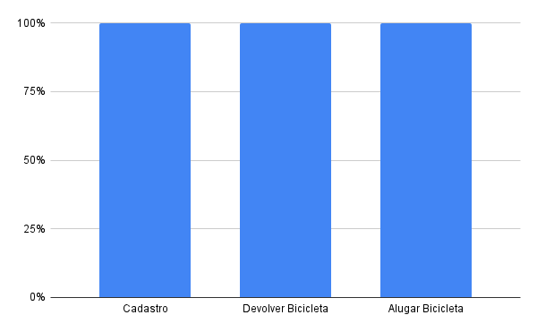

# Verificação Istar

## Versionamento
| Versão | Data | Modificação | Autor |
|-|-|:-:|:-:|
| 1.0 | 17/03 | Criação documento | Luiz Henrique |
| 1.1 | 19/03 | Adição dados de verifiação | Luiz Henrique |

## Introdução

&emsp;&emsp; A verificação é uma metodologia que visa garantir que os entregáveis de um projeto, garantindo que os pontos analisados cumpram com seus requisitos especificados.

&emsp;&emsp;Essa etapa consiste de uma técnica que não depende da interação com os usuários finais do produto, sendo realizada através da visão técnica do desenvolvedor. 

&emsp;&emsp;O presente documento tem como objetivo apresentar a verificação realizada no documento de modelagem <a href="https://requisitos-de-software.github.io/2021.2-Tembici/modelagem/istar/">Istar</a>.

## Metodologia

&emsp;&emsp;A metodologia utilizada para realizar a verificação foi a técnica de inspeção pela estratégia de leitura e checklist, por ser uma metodologia objetiva e eficaz para identificar se todos os critérios atendidos sendo muito eficaz em identificar lacunas e melhorias nas atividades realizadas.

&emsp;&emsp;  Os critérios abordados têm o papel de verificar se o artefato cumpre as especificações esperadas e seu propósito para o projeto. Assim identificando defeitos e melhorias possibilitando correções. 

&emsp;&emsp;Os critérios do checklist foram desenvolvidos considerando os apectos tecnicos da metodologia Istar como a execução correta da analise dos autores, agentes, tarefas, recursos e afins, os memsmos foram analisados e respondidos quanto aos seus aspectos utilizando "✔" (Sim) ou "✖" (Não), onde o Não pode evidenciar um  defeito, algo que precisa ser melhorado ou algo que derive de uma decisão do projeto.

&emsp;&emsp;O presente processo foi realizado pelo membro Luiz Henrique e revalidado com os demais membros do grupo no dia 17 de Março de 2022.

## Resultados

*Tabela 1: Tabela de verficação de critérios - Verificação Istar*

| Id | Verificação | Cadastro | Alugar Bicicleta | Devolver Bicicleta |
|-|-|:-:|:-:|:-:|
| 1 | Legendas completas e explicativas? | ✔ | ✔ | ✔ |
| 2 | Está devidamente rastreávl? | ✔ | ✔ | ✔ |
| 3 | Respeito às regras gerais da metodologia? | ✔ | ✔ | ✔ |
| 4 | Autores são condizentes? | ✔ | ✔ | ✔ |
| 5 | Agentes são condizentes? | ✔ | ✔ | ✔ |
| 6 | Tarefas autoexplicativas? | ✔ | ✔ | ✔ |
| 7 | Softgoals autoexplicativos? | ✔ | ✔ | ✔ |
| 8 | Recursos autoexplicativos? | ✔ | ✔ | ✔ |
| 9 | Objetivos autoexplicativos? | ✔ | ✔ | ✔ |
| 10 | Fluxo das setas correto? | ✔ | ✔ | ✔ |
| 11 | Links de dependência são do tipo correto? | ✔ | ✔ | ✔ |
| 12 | Ortografia correta? | ✔ | ✔ | ✔ |
| 13 | iStar condiz com os requisitos elicitados? | ✔ | ✔ | ✔ |
| 14 | Possui Modelo dependência? | ✔ | ✔ | ✔ |
| 15 | Possui Modelo rationale | ✔ | ✔ | ✔ |
| 16 | Diagrama autoexplicativo? | ✔ | ✔ | ✔ |
| Total | 
 -- 
  | 100% | 100% | 100% |

*Fonte: Elaboração dos autores do presente documento*

&emsp;&emsp;De acordo com a verificação, o documento iStar se encontra de acordo com os padrões esperados, os errod idêntificados foram devidamente corrigidos. Os resultados podem ser vizualidos de maneira grafica abaixo:

*Imagem 1: Grafico de resultados - Verificação Istar*

*Fonte: Elaboração dos autores do presente documento*

## Bibliografia

 Serrano, M.; Serrano, M. Requisitos - Aula 23. Acesso em: 16 de Março de 2022

