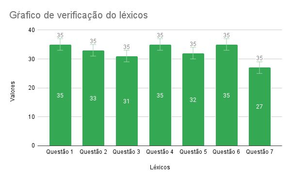

## Versionamento
| Versão | Data  | Descrição                                     | Autor(es) |
| ------ | ----- | --------------------------------------------- | --------- |
| 1.0    | 21/03 | Abertura do documento de varificação do léxicos | Paulo henrique |
| 1.1    | 21/03 | Adição da tabela com as perguntas | Paulo henrique |
| 1.2    | 21/03 | Correção da tabela | Paulo henrique |
| 1.3    | 21/03 | Atualização da tabela de verificação| Paulo henrique |
| 1.4    | 22/03 | Entrega da tabela de conclusão da verificação | Paulo henrique |
| 1.5    | 22/03 | Correções do PR | Paulo henrique |

*Tabela 1: Tabela de versionamento*

## Introdução

 A verificação corresponde a uma metodologia que visa garantir que os produtos de um trabalho selecionado cumpram com seus requisitos especificados. Essa etapa, também consiste de uma técnica que não depende da intervenção humana dos usuários, sendo feita através do viés do desenvolvedor. O escopo dessa verificação se limita ao documento de modelagem <a href="../../../modelagem/lexicos/">Léxicos</a>.

## Metodologia

 Para a realização dessa verificação, será utilizada a técnica de inspeção pela estratégia de leitura e checklist, os critérios abordados tem o papel de contribuir para verificar se de fato os léxicos atendem a seu propósito e também apontando defeitos que permitem correções. Os critérios podem ser respondidos com "✅" (Sim) ou "❌" (Não), onde o Não provavelmente evidencia algum defeito que precisa ser melhorado.

* Legenda

| Abreviação |                Descrição                |
| :--------: | :-------------------------------------: |
|   **L**    |                 Léxico                  |
| **O/V/E**  | Classificação (estado, verbo ou objeto) |
|   **XX**   |                Numeração                |
|   **✅**   |                   Sim                   |
|   **❌**   |                   Não                   |

*Tabela 2: Tabela de legenda da verificação*

| **Número** | **Critérios**                              | **LO01** | **LO02** | **LO03** | **LO04** | **LO05** | **LO06** | **LO07** | **LO08** | **LO09** | **LO10** | **LV01** | **LV02** | **LV03** | **LV04** | **LV05** | **LV06** | **LV07** | **LV08** | **LV09** | **LV10** | **LV11** | **LV12** | **LV13** | **LV14** | **LV15** | **LV16** | **LV17** | **LE01** | **LE02** | **LE03** | **LE04** | **LE05** | **LE06** | **LE07** | **LE08** |
| :--------: | ------------------------------------------ | :------: | :------: | :------: | :------: | :------: | :------: | :------: | :------: | :------: | :------: | :------: | :------: | :------: | :------: | :------: | :------: | :------: | :------: | :------: | :------: | :------: | :------: | :------: | :------: | :------: | :------: | :------: | :------: | :------: | :------: | :------: | :------: | :------: | :------: | :------: |
|     1      | **Está padronizado?**                      |    ✅     |    ✅     |    ✅     |    ✅     |    ✅     |    ✅     |    ✅     |    ✅     |    ✅     |    ✅     |    ✅     |    ✅     |    ✅     |    ✅     |    ✅     |    ✅     |    ✅     |    ✅     |    ✅     |    ✅     |    ✅     |    ✅     |    ✅     |    ✅     |    ✅     |    ✅     |    ✅     |    ✅     |    ✅     |    ✅     |    ✅     |    ✅     |    ✅     |    ✅     |    ✅     |
|     2      | **Possui informações concisas?**           |    ✅     |    ✅     |    ✅     |    ✅     |    ✅     |    ✅     |    ✅     |    ✅     |    ✅     |    ❌     |    ✅     |    ✅     |    ✅     |    ✅     |    ✅     |    ✅     |    ✅     |    ✅     |    ✅     |    ✅     |    ✅     |    ✅     |    ✅     |    ✅     |    ✅     |    ✅     |    ❌     |    ✅     |    ✅     |    ✅     |    ✅     |    ✅     |    ✅     |    ✅     |    ✅     |
|     3      | **Noção está compreensível?**              |    ✅     |    ❌     |    ✅     |    ✅     |    ✅     |    ✅     |    ✅     |    ❌     |    ❌     |    ✅     |    ✅     |    ✅     |    ✅     |    ✅     |    ✅     |    ✅     |    ✅     |    ✅     |    ❌     |    ✅     |    ✅     |    ✅     |    ✅     |    ✅     |    ✅     |    ✅     |    ✅     |    ✅     |    ✅     |    ✅     |    ✅     |    ✅     |    ✅     |    ✅     |    ✅     |
|     4      | **Classificação está correta?**            |    ✅     |    ✅     |    ✅     |    ✅     |    ✅     |    ✅     |    ✅     |    ✅     |    ✅     |    ✅     |    ✅     |    ✅     |    ✅     |    ✅     |    ✅     |    ✅     |    ✅     |    ✅     |    ✅     |    ✅     |    ✅     |    ✅     |    ✅     |    ✅     |    ✅     |    ✅     |    ✅     |    ✅     |    ✅     |    ✅     |    ✅     |    ✅     |    ✅     |    ✅     |    ✅     |
|     5      | **Impacto está correto?**                  |    ✅     |    ✅     |    ✅     |    ✅     |    ✅     |    ✅     |    ✅     |    ✅     |    ✅     |    ✅     |    ❌     |    ✅     |    ✅     |    ✅     |    ❌     |    ✅     |    ✅     |    ✅     |    ✅     |    ✅     |    ✅     |    ❌     |    ✅     |    ✅     |    ✅     |    ✅     |    ✅     |    ✅     |    ✅     |    ✅     |    ✅     |    ✅     |    ✅     |    ✅     |    ✅     |
|     6      | **Sinônimos são compatíveis? (se houver)** |    ✅     |    ✅     |    ✅     |    ✅     |    ✅     |    ✅     |    ✅     |    ✅     |    ✅     |    ✅     |    ✅     |    ✅     |    ✅     |    ✅     |    ✅     |    ✅     |    ✅     |    ✅     |    ✅     |    ✅     |    ✅     |    ✅     |    ✅     |    ✅     |    ✅     |    ✅     |    ✅     |    ✅     |    ✅     |    ✅     |    ✅     |    ✅     |    ✅     |    ✅     |    ✅     |
|     7      | **Ortografia está correta?**               |    ❌     |    ❌     |    ✅     |    ✅     |    ✅     |    ✅     |    ❌     |    ❌     |    ❌     |    ✅     |    ✅     |    ✅     |    ✅     |    ✅     |    ✅     |    ✅     |    ✅     |    ✅     |    ✅     |    ✅     |    ✅     |    ✅     |    ✅     |    ✅     |    ❌     |    ✅     |    ❌     |    ✅     |    ✅     |    ✅     |    ✅     |    ✅     |    ✅     |    ✅     |    ✅     |

*Tabela 3: Tabela de verificação*

## Resultados

    

*Tabela 3: Gráfico de resultados - Verificação léxicos*

<b>Possíveis correções:</b>

* Questões ortográficos de alguns léxicos
* Tornar alguns léxicos mais concisos
* Melhorar o entendimento do impacto e noção de alguns léxicos

## Referências

[1] SERRANO, Milene; SERRANO, Maurício. <b>Requisitos - Aula 10</b>. 2019. 35 slides. Material apresentado para a disciplina de Requisitos de Software no curso de Engenharia de Software da UnB, FGA. Acesso em: 21 de Março de 2022.
