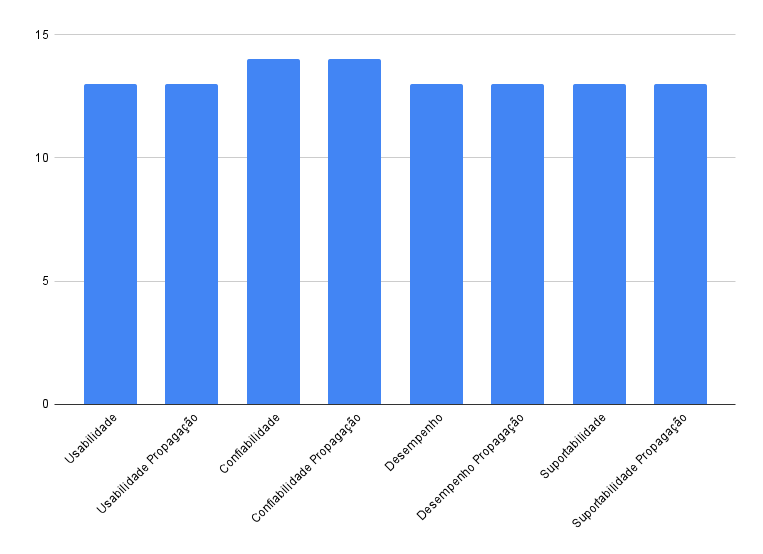

# Vrificação NFR Framework

## Versionamento
| Versão | Data | Modificação | Autor |
|-|-|:-:|:-:|
| 1.0 | 19/03 | Criação documento | Luiz Henrique |
| 1.1 | 19/03 | Adição dados de verifiação | Luiz Henrique |

## Introdução

&emsp;&emsp; A verificação é uma metodologia que visa garantir que os entregaveis de um projeto, garantindo que os pontos analisados cumpram com seus requisitos especificados.

&emsp;&emsp;Esaa etapa consiste de uma técnica que não depende da interação com os usuários finais do produto, sendo realizada atrvés da visão tecnica do desenvolvedor. 

&emsp;&emsp;O presente documento tem como objetivo apresentar a verificação realizada no documento de modelagem <a href="https://requisitos-de-software.github.io/2021.2-Tembici/modelagem/nfrframework/">NFR Framework</a>.

## Metodologia

&emsp;&emsp;A metodologia utilizada para realizar a verificação foi a técnica de inspeção pela estratégia de leitura e checklist, por ser uma metodologia objetiva e eficaz para identificar se todos os critérios atendidos sendo muito eficaz em identidicar lacunas e melhorias nas atvidades realizadas.

&emsp;&emsp;  Os critérios abordados têm o papel de verificar se o artefato cumpre as especificações esperadas e seu propósito para o projeto. Assim identificando defeitos e melhorias possibilitando correções. 

&emsp;&emsp;Os itens do checklist foram montados considerando os aspectos do tecnicos do NFR Framework como os softgoals e tipos contribuição mas também boas praticas do projetos e recomendações da discicplina e respondidos quanto aos seus aspectos utilizando "✔" (Sim) ou "✖" (Não), onde o Não pode evidenciar um  defeito, algo que precisa ser melhorado ou algo que derive de uma decisão do projeto.

&emsp;&emsp;O presente processo foi realizado pelo membro Luiz Henrique e revalidado com os demais membros do grupo no dia 17 de Março de 2022.

## Resultados

*Tabela 1: Tabela de verficação de critérios - Verificação NRF Framework*
| Id | Questões | Usabilidade | Usabilidade Propagação | Confiabilidade | Confiabilidade Propagação | Desempenho | Desempenho Propagação | Suportabilidade | Suportabilidade Propagação |
| :----: | ----------- | :---------: | :------------: | :--------: | :-------------: | :-------------: | :-------------: | :-------------: | :-------------: |
| 1 | O fluxo do diagrama está bem representado? | ✔ | ✔ | ✔ | ✔ | ✔ | ✔ | ✔ | ✔ |
| 2 | Os softgoals condizem com o contexto? | ✔ | ✔ | ✔ | ✔ | ✔ | ✔ | ✔ | ✔ |
| 3 | Os softgoals são decompostos em operacionalizações? | ✔ | ✔ | ✔ | ✔ | ✔ | ✔ | ✔ | ✔ |
| 4 | Existem softgoals suficientes no diagrama para representar o contexto? | ✔ | ✔ | ✔ | ✔ | ✔ | ✔ | ✔ | ✔ |
| 5 | As operacionalizações condizem com o contexto? | ✔ | ✔ | ✔ | ✔ | ✔ | ✔ | ✔ | ✔ |
| 6 | Existem operacionalizações suficientes no diagrama para representar o contexto? | ✔ | ✔ | ✔ | ✔ | ✔ | ✔ | ✔ | ✔ |
| 7 | As contribuições dos impactos estão devidamente embasadas? | ✔ | ✔ | ✔ | ✔ | ✔ | ✔ | ✔ | ✔ |
| 8 | A propagação está bem representada? | ✔ | ✔ | ✔ | ✔ | ✔ | ✔ | ✔ | ✔ |
| 9 | Os impactos estão propagados corretamente? | ✔ | ✔ | ✔ | ✔ | ✔ | ✔ | ✔ | ✔ |
| 10 | As contribuições AND estão corretamente representadas e aplicadas? | ✔ | ✔ | ✔ | ✔ | ✔ | ✔ | ✔ | ✔ |
| 11 | As contribuições OR estão corretamente representadas e aplicadas? | ✔ | ✔ | ✔ | ✔ | ✔ | ✔ | ✔ | ✔ |
| 12 | Existem contribuições negativas? | ✖ | ✖ | ✔ | ✔ | ✖  | ✖  | ✖  | ✖  |
| 13 | As contribuições positivas estão corretamente representadas e aplicadas? | ✔ | ✔ | ✔ | ✔ | ✔ | ✔ | ✔ | ✔ |
| 14 | As contribuições negativas estão corretamente representadas e aplicadas? | ✔ | ✔ | ✔ | ✔ | ✔ | ✔ | ✔ | ✔ |
|    | Total | 92.9% | 92.9% | 100% | 100% | 92.9% | 92.9% | 92.9% |  |

*Fonte: Elaboração dos autores do presente documento*

&emsp;&emsp; A verificação do documento NFR Framework se encontra de acordo com os padrões esperados. Porém alguns diagramas confecção dde Interdependência de Softgoal priorizou as contribuições positivas em detrimento das negativa. Porém vale resaltar que as contribuições negativas apesar de não se encaixarem em todos os contextos são importantes para o projeto, uma vez que permitirá que o desenvolvedor entenda o que não se deve fazer para atingir um determinado objetivo. Assim, essa verificação contribuirá bastante com a elaboração e aprimoramento da modelagem feita pela a equipe. Pode-se visualizar os resultados a partir do gráfico abaixo:

## 6. Bibliografia

SERRANO, Milene; SERRANO, Maurício. Requisitos - Aula 10. Acesso em: 16 de Março de 2022