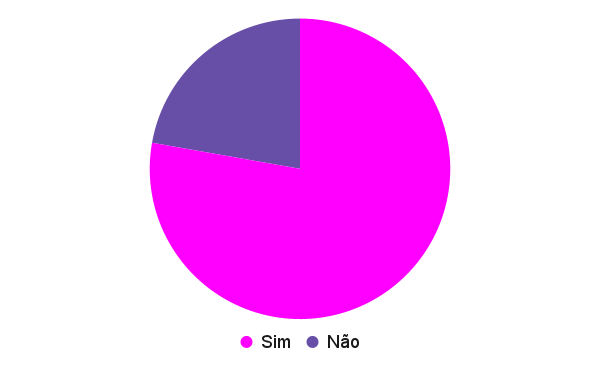

# Verificação Backlog do Produto
## Versionamento

| Versão | Data | Modificação | Autor |
|-|-|:-:|:-:|
| 1.0 | 21/03/2022 | Criação do artefato | João Victor Batista |
| 1.1 | 08/04/2022 | Revisão e Adição de revisor | Luiz Hnerique |
| 1.2 | 09/04/2022 | Padronização de Legendas e Metodologias | Victor Eduardo |

*Tabela 1: versionamento*

## Introdução

&emsp;&emsp;Tendo como base o projeto <a href="https://requisitos-de-software.github.io/2021.1-TesouroDireto/verificacao_suplementar/">Tesouro Direto</a> realizado por alunos da disciplina em semestres passados, e com o material [1], disponibilizados pelo professor para estudo, foi possível fazer a verificação do documento buscando a máxima assertividade na realização desta atividade, que tem como finalidade revisar o documento de <a href="https://requisitos-de-software.github.io/2021.2-Tembici/modelagem/backlog/product_backlog/">Backlog do Produto</a> deste projeto e apontar análises e possíveis pontos de melhora.

## Metodologia

&emsp;&emsp;Usando o método de Inspeção, no qual o objetivo é identificar problemas no documento de modo a avaliar se ele está de acordo com o modelo e com o esperado do artefato [1], foi criado um checklist de critérios para a avaliação do Backlog do Produto. O presente artefato foi feito pelo integrante do grupo João Victor.

## Resultados
### Legenda
- ✅: Sim
- ❌: Não

| Item | Resposta |
|-|:-:|
| Épicos corretamente relacionados às histórias de usuário? |✅|
| IDs referenciados corretamente? |✅|
| Há links para as Histórias? |❌|
| Todas as Histórias possuem priorização? |❌|
| A priorização está de acordo? |✅|
| Existe rastrabilidade? |✅|
| Os termos importantes estão relacionados ao léxico? |✅|
| Possui versionamento? |✅|
| Possui legenda? |✅|

*Tabela 2: Tabela de resultados do checklist*

### Conclusão

&emsp;&emsp;O artefato está adequado a seu projeto, cumprindo àquilo que se propõe a resolver, necessitando apenas de algumas alterações e adições para que haja uma maior rastreabilidade no projeto ao relacionar os requisitos citados nesse documento.

  
*Imagem 1 - Gráfico do resultado do checklist realizado*  
*Fonte: Elaboração dos autores do presente documento*

## Referências 

 SERRANO, Maurício; SERRANO, Milene; Requisitos - Aula 23. Acesso em: 21 de Março de 2022

