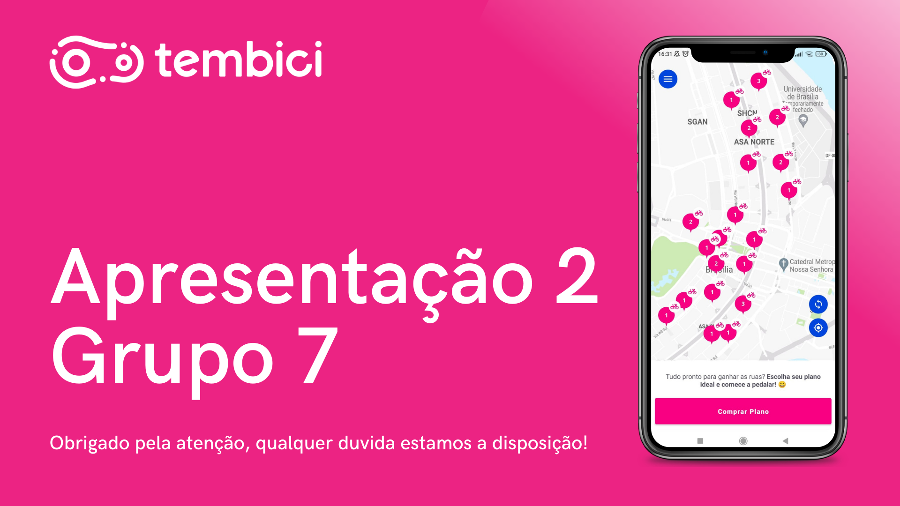

# Ponto de controle 2

## Versionamento

| Versão | Data | Modificação | Autor |
|-|-|:-:|:-:|
| 1.0 | 18/02 | Adição da apresentação 2 | Luiz Henrique Fernandes Zamprogno, Victor Eduardo |
| 1.1 | 24/02 | Padronização da página | Luiz Henrique, Victor Eduardo|

*Tabela 1: versionamento*

## Introdução

Nesse documento tem como objetivo armazenar a apresentação do segundo ponto de controle, que tem como objetivo fundamental o entendimento e avaliação do processo em que o projeto está seguindo. Ocorrere uma apresentação por ponto de controle na disciplina de Requisitos de Software que será avaliado pelo Dr. Profº André Barros na Universidade de Brasília - FGA, o presente documento apresenta o segundo ponto de controle que consiste na etapa de Técnicas e Priorização. 

## Apresentação

*Imagem 1: Apresentação 2 thumbnail*