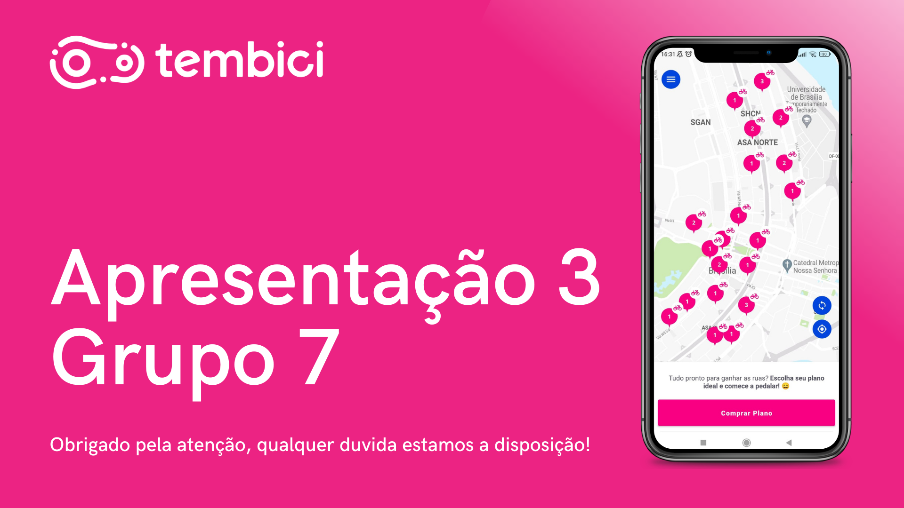

# Ponto de controle 3

## Versionamento

| Versão | Data | Modificação | Autor |
|-|-|:-:|:-:|
| 1.0 | 04/03 | Gravação da apresentação | Luiz Henrique, Livia Rodrigues, Paulo Henrique, Victor Eduardo, Gabriel Sabanai, João Victor |
| 1.1 | 05/03 | Edição apresentação | Livia Rodrigues |
| 1.2 | 06/03 | Adição da apresentação | Luiz Henrique Fernandes Zamprogno |

*Tabela 1: versionamento*

## Introdução

&emsp;&emsp;Esse documento tem como objetivo armazenar a apresentação do terceiro ponto de controle, que tem como objetivo fundamental o entendimento e avaliação do processo em que o projeto está seguindo. Ocorrere uma apresentação por ponto de controle na disciplina de Requisitos de Software que será avaliado pelo Dr. Profº André Barros na Universidade de Brasília - FGA, o presente documento apresenta o terceiro ponto de controle que consiste na etapa de Modelagem.

## Apresentação

*Imagem 1: Apresentação 3 thumbnail*

*Fonte: Elaboração dos autores do presente documento*