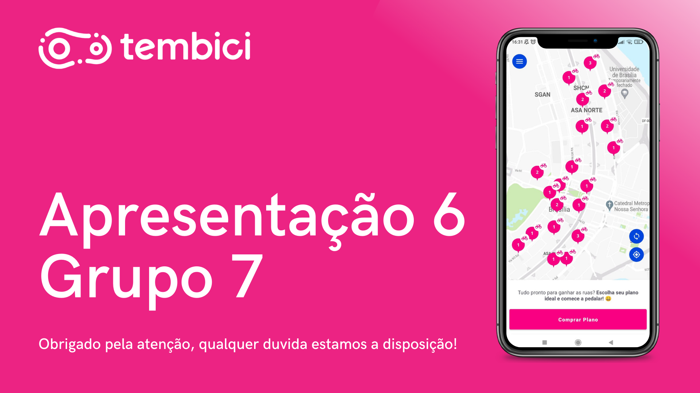

# Ponto de controle 6

## Versionamento

| Versão | Data | Modificação | Autor |
|-|-|:-:|:-:|
| 1.0 | 01/04 | Gravação | Luiz Henrique, Livia Rodrigues, Paulo Henrique, Victor Eduardo, João Victor |
| 1.1 | 02/04 | Edição apresentação | Victor Eduardo |
| 1.2 | 03/03 | Adição da apresentação | Luiz Henrique |

*Tabela 1: versionamento*

## Introdução

&emsp;&emsp;Esse documento tem como objetivo armazenar a apresentação do sexta ponto de controle, que tem como objetivo fundamental o entendimento e avaliação do processo em que o projeto está seguindo. Ocorrere uma apresentação por ponto de controle na disciplina de Requisitos de Software que será avaliado pelo Dr. Profº André Barros na Universidade de Brasília - FGA, o presente documento apresenta o sexto ponto de controle que consiste na etapa de Pós-Rastriabilidade. 

## Apresentação

*Imagem 1: Apresentação 6 thumbnail*

*Autor: Luiz Henrique*