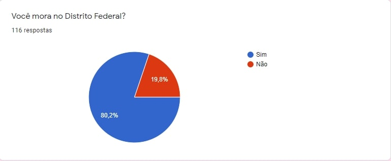
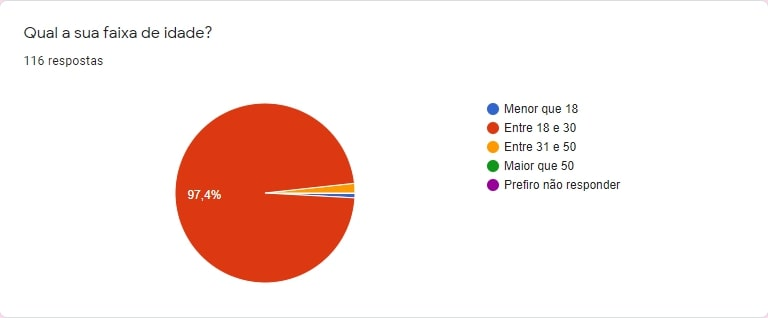
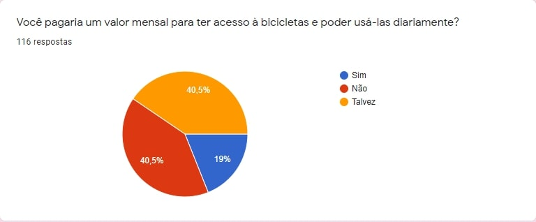
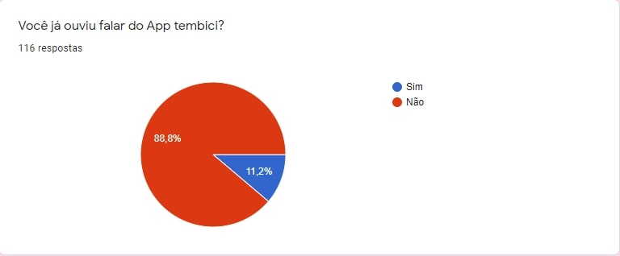
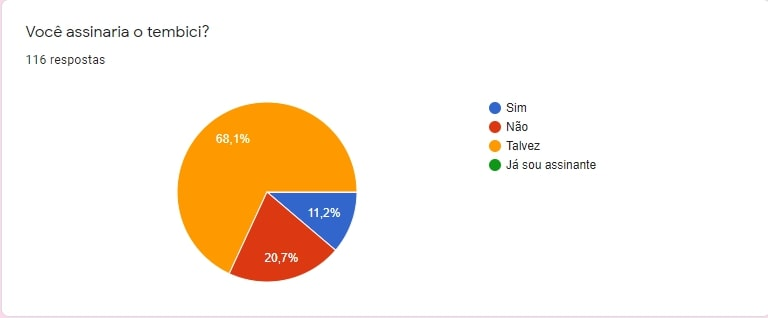
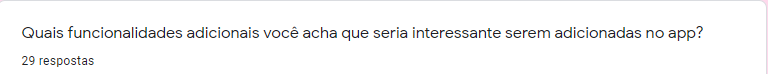

## Versionamento

| Versão | Data | Modificação | Autor |
|-|-|:-:|:-:|
| 1.0 | 12/02 | Criação e prospecção do questionario |
| 1.1 | 12/02 | Criação da seção Técnicas e Questionário | Victor Eduardo |
| 1.2 | 18/02 | Adição das respostas do questionário | Victor Eduardo |
| 1.3 | 18/02 | Avaliação das respostas e requisitos | Victor Eduardo |
| 1.4 | 18/02 | Introspecção Requisitos | Luiz Henrique, Victor Eduardo, Livia Rodriges, João Victor |
| 1.5 | 19/02 | Adição de personas | Lívia Rodrigues, João Victor |

*Tabela 1: Versionamento*

# Técnicas

## Personas

Persona é um personagem fictício que reflete um grupo de usuários, definidas por seus objetivos. Um conjunto de elementos são usados para denifir uma persona, são eles: identidade, status, objetivos, habilidades, tarefas, relacionamentos, requisitos e expectativas. São derivadas através de um processo de investigação que lista características dos usuários e descreve seus perfis. Antipersonas são personagens fictícios que servem para exemplificar para quem o produto não é direcionado.

* Persona 1

Nome: Letícia.
Idade: 17 anos.
Escolaridade: Ensino Médio Incompleto.
Profissão: Estudante.
Desafios: Não tem condições de comprar uma bicicleta de qualidade.
Expectativas: Conseguir passear esporadicamente com seus amigos e familiares por Brasília.
Nível de conhecimento sobre o app: Utiliza o aplicativo esporadicamente.

* Persona 2

Nome: Ricardo.
Idade: 34 anos.
Escolaridade: Ensino Superior Completo.
Profissão: Psicólogo.
Desafios: Mesmo morando relativamente perto do seu trabalho, ao utilizar apenas meio de transporte próprio acaba enfrentando longos períodos de engarrafamento além de ter dificuldade para estacionar seu veículo quando chega no trabalho. Tudo isso somado aos elevados preços de combustível, provocam estresse diário e custos desnecessários.
Expectativas: Contornar o obstáculo do engarrafamento e do preço de combustível utilizando as bicicletas para se deslocar para o trabalho e de volta.
Nível de conhecimento sobre o app: Utiliza constantemente o aplicativo.

* Persona 3

Nome: Francisco.
Idade: 41 anos.
Escolaridade: Ensino Médio Completo.
Profissão: Técnico em Telecomunicações.
Desafios: Compreender como funciona o aluguel de bicicletas.
Expectativas: Utilizar bicicletas esporadicamente para uso recreativo.
Nível de conhecimento sobre o app: Primeira vez utilizando um app desse tipo.

* Persona 4

Nome: Thaís.
Idade: 22 anos.
Escolaridade: Ensino Superior Incompleto.
Profissão: Estudante de publicidade.
Desafios: Fazendo estágio e faculdade e sem possuir automóvel próprio, depende do transporte público, que tem horários e trajetos inflexíveis, para se deslocar. Por ter muitas demandas, também tem dificuldades para inserir atividades físicas em sua rotina.
Expectativas:  Conseguir um meio de transporte flexível para se deslocar mais rápido entre o estágio, faculdade e sua casa e, ao mesmo tempo, realizar atividades físicas.
Nível de conhecimento sobre o app: Utiliza o aplicativo diariamente para a otimização de seu tempo.

* Antipersona

Nome: Mateus.
Idade: 28 anos.
Escolaridade: Ensino Superior.
Profissão: Funcionário Público.
Desafios: Por conta de um acidente seus movimentos foram debilitados, é cadeirante.

## Instrospecção

### Metodologia

Introspecção é uma técnica de Elicitação de Requisitos que consiste na compreensão das funcionalidades e propriedades necessárias para o sucesso do produto. Em suma, a técnica Introspecção pode ser descrita como uma equipe de engenheiros de requisitos que se coloca no lugar do usuário e analisa quais as necessidades e desejos do mesmo ao utilizar o sistema proposto ou a ser analisado, assim obtendo a partir do mesmo requisitos do Software. 

### Requisitos 
| Código | Requisito | Tipo de requisito |
|:--:|--|:--:|
| IT01 |O usuário deverá poder acessar o aplicativo utilizando seu aparelho móvel | RN |
| IT02 | O usuário poderá visualizar as informações em tempo real | RN |
| IT03 | O usuário poderá visualizar onde estão localizados os pontos de bicicletas | RF |
| IT04 | O usuário poderá consultar  por meio de um mapa os pontos de bicicletas| RF |
| IT05 | O usuário poderá por meio do mapa visualizar sua localização atual | RF |
| IT06 |O usuário poderá verificar a quantidade de um bicicletas em cada ponto de bicicleta | RF |
| IT07 | O usuário deverá estar logado e possuir um plano para conseguir pegar uma bicicleta | RF |
| IT08 | O usuário poderá  desbloquear uma bicicleta utilizando um código do aplicativo a ser digitado em teclado  localizado no posto de bicicleta | RF |
| IT09 | O usuário poderá verificar a quantidade de vagas em cada ponto de bicicleta | RF |
| IT10 | O usuário poderá visualizar enquanto estiver em viagem o tempo que está sobre posse da bicicleta | RF |
| IT11 | O usuário poderá visualizar enquanto estiver em viagem consumo de calorias gastas enquanto está em viagem | RF |
| IT12 | O usuário poderá visualizar enquanto estiver em viagem economia de gás carbônico em relação ao gasto utilizando um veículo à base de combustível fóssil | RF |
| IT13 | O usuário poderá visualizar seu histórico de viagens para consultar informações | RF |
| IT14 | O usuário poderá escolher um plano adequado para sua utilização | RF |
| IT15 | O usuário poderá utilizar um cupom de desconto caso possua para diminuir o valor de seu plano | RF |
| IT16 | O usuário deverá realizar o pagamento do plano escolhido utilizando um cartão de crédito | RF |

*Tabela 2: Requisitos Introspecção*

## Questionário
### Introdução

&emsp;&emsp;O questionário é uma ótima maneira de elicitar requisitos, pois com ele é fácil saber qual as principais características e necessidades do público alvo, além, claro, de delinear este público.

### Questões
#### Questão 1

Imagem 1 - Pergunta sobre onde o entrevistado mora

&emsp;Tendo em vista que o público o qual o questionário seria destinado seria de moradores do DF e região, e esse é um dos locais nos quais pode-se fazer uso do app, a pergunta é importante para saber a popularidade do app dentre um público que possa vir a usar o app por morar numa região que ele está disponível. Como resultado, obteve-se que a maior parte dos entrevistados (80.2%) residem no Distrito Federal.

#### Questão 2
<!--{width="80"}-->

Imagem 2 - Pergunta sobre a idade do entrevistado

&emsp;A pergunta é importante para saber como as respostas podem variar de acordo com a faixa de idade do entrevistado. Como resultado, obteve-se que o público entrevistado foi jovem, majoritariamente na faixa de idade entre 18 e 30 anos.

#### Questão 3
<!--{width="80"}-->

Imagem 3 - Pergunta sobre a frequência que o entrevistado usa bicicletas

&emsp;Como o app se baseia no uso de bicicletas, a pergunta vem a ser importante para saber como a opinião do público sobre o app varia de acordo de como ele usa as bicicletas. Como resultado obteve-se que os entrevistados não costumam andar de bicicleta.

#### Questão 4
<!--{width="80"}-->

Imagem 4 - Pergunta sobre o interesse do entrevistado em assinar um plano para uso de bicicletas

&emsp;A pergunta é importante para saber se o entrevistado teria interesse em uma possível asinatura de um dos planos do app. Como resultado obteve-se que uma assinatura mensal para aluguel de bicicletas tem uma alta taxa de rejeição, porém boa parte dos entrevistados reponderam que poderiam vir a fazer uma assinatura.

#### Questão 5
<!--{width="80"}-->

Imagem 5 - Pergunta sobre o conhecimento do entrevistado sobre o app

&emsp;A pergunta é importante para saber a popularidade do app dentre os entrevistados. Obteve-se que os entrevistados, em sua maioria, não tinha ouvido falar do Tembici, indicando uma flata de popularidade do app, consequência de uma possível falha no markenting do app.

#### Questão 6
<!--{width="80"}-->

Imagem 6 - Pergunta sobre a opinião do entrevistado sobre o app

&emsp;A pergunta é importante para saber a opinião do entrevistado sobre o app. Após uma breve explicação do app, os entrevistados reponderam que acham a proposta desse interessante, ou talvez, não tendo nenhuma resposta negativa, indicando o potencial que o app possui.

#### Questão 7
<!--{width="80"}-->

Imagem 7 - Pergunta sobre o interesse do entrevistado em fazer assinatura do app

&emsp;A pergunta é importante para saber se o entrevistado poderia vir a ser um usuário do app. Uma pequena parte do público respondeu positivamente a pergunta, porém a maior parte do público respondeu que poderia vir a assinar. Nenhum dos entrevistados eram assinantes do app.

#### Questão aberta
<!--{width="80"}-->

Imagem 8 - Pergunta aberta sobre as funcionalidades do app

&emsp;É uma das perguntas mais importantes do questionário, uma vez que assim pode-se extrair funcionalidades que seriam interessantes ao usuário. Obteve-se 29 respostas para essa pergunta e analisando as respostas foi possível separá-las em 8 tópicos:

* Ter mais estações, e serem mais espalhadas pelo DF e não concentradas apenas na região central
* Ter mais opções de assinatura para o app ao invés de só a assinatura periódica, como aluguel por km, hora, por viagem, entre outros
* Ter intereção com outros usuários, tendo a possibilidade de poder compartilhar sua rota e ver pessoas adicionadas próximas
* Ter dicas das melhoras rotas, além de eventos de interesse próximos ao usuário
* Poder avaliar certas áreas ou trajetos, quanto a segurança e infraestrutura por exemplo, e a avaliação estar disponível a outros usuários
* Ter outros meios de transporte disponíveis, patinetes por exemplo, e a opção de bikes esportivas 
* Ter a possibilidade de reservar uma bicicleta por alguns minutos via app
* Incluir gamificação para a prática de exercícios físicos e pontos a serem trocados para usuários que sempre devolverem a bicicleta inteira e no prazo

### Requisitos 
| Código | Requisito | Tipo de requisito |
|:--:|--|:--:|
| Q01 | O app deve permitir que o usuário consiga assinar um plano | RF |
| Q02 | O app deve mostrar ao usuário a localização das estações | RF |
| Q03 | O app deve mostrar ao usuário a quantidade de bicicletas em cada estação | RF |
| Q04 | O app deve permitir que usuário assinante consiga retirar uma bicicleta em uma estação| RF |
| Q05 | O app deve disponibilizar o histórico de viagens do usuário, contendo o trajeto percorrido, calorias e quanto CO2 deixou de emitir | RF |

*Tabela 3: Requisitos Questionario*

## Referências Bibliográficas

