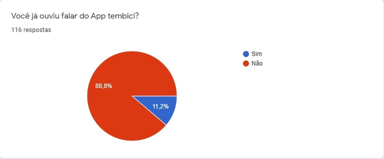
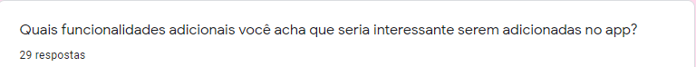

# Questionário
## Versionamento

| Versão | Data | Modificação | Autor |
|-|-|:-:|:-:|
| 1.0 | 12/02 | Criação e prospecção do questionario | Victor Eduardo |
| 1.1 | 12/02 | Criação da seção Técnicas e Questionário | Victor Eduardo |
| 1.2 | 18/02 | Adição das respostas do questionário | Victor Eduardo |
| 1.3 | 18/02 | Avaliação das respostas e requisitos | Victor Eduardo |
| 1.4 | 24/02 | Padronização da página | Luiz Henrique, Victor Eduardo |
| 1.4 | 18/02 | Revisão | Luiz Henrique |
| 1.5 | 04/03 | Adição revisor | Luiz Henrique |

*Tabela 1: versionamento*

## Introdução

&emsp;&emsp;O questionário é uma ótima maneira de elicitar requisitos, pois com ele é fácil saber qual as principais características e necessidades do público alvo, além, claro, de delinear este público.

## Metodologia
<!-- Adicionar Metodologia -->

## Questões
### Questão 1

Imagem 1 - Pergunta sobre onde o entrevistado mora

&emsp;Tendo em vista que o público o qual o questionário seria destinado seria de moradores do DF e região, e esse é um dos locais nos quais pode-se fazer uso do app, a pergunta é importante para saber a popularidade do app dentre um público que possa vir a usar o app por morar numa região que ele está disponível. Como resultado, obteve-se que a maior parte dos entrevistados (80.2%) residem no Distrito Federal.

#### Questão 2

Imagem 2 - Pergunta sobre a idade do entrevistado

&emsp;A pergunta é importante para saber como as respostas podem variar de acordo com a faixa de idade do entrevistado. Como resultado, obteve-se que o público entrevistado foi jovem, majoritariamente na faixa de idade entre 18 e 30 anos.

#### Questão 3

Imagem 3 - Pergunta sobre a frequência que o entrevistado usa bicicletas

&emsp;Como o app se baseia no uso de bicicletas, a pergunta vem a ser importante para saber como a opinião do público sobre o app varia de acordo de como ele usa as bicicletas. Como resultado obteve-se que os entrevistados não costumam andar de bicicleta.

#### Questão 4

Imagem 4 - Pergunta sobre o interesse do entrevistado em assinar um plano para uso de bicicletas

&emsp;A pergunta é importante para saber se o entrevistado teria interesse em uma possível asinatura de um dos planos do app. Como resultado obteve-se que uma assinatura mensal para aluguel de bicicletas tem uma alta taxa de rejeição, porém boa parte dos entrevistados reponderam que poderiam vir a fazer uma assinatura.

#### Questão 5

Imagem 5 - Pergunta sobre o conhecimento do entrevistado sobre o app

&emsp;A pergunta é importante para saber a popularidade do app dentre os entrevistados. Obteve-se que os entrevistados, em sua maioria, não tinha ouvido falar do Tembici, indicando uma flata de popularidade do app, consequência de uma possível falha no markenting do app.

#### Questão 6

Imagem 6 - Pergunta sobre a opinião do entrevistado sobre o app

&emsp;A pergunta é importante para saber a opinião do entrevistado sobre o app. Após uma breve explicação do app, os entrevistados reponderam que acham a proposta desse interessante, ou talvez, não tendo nenhuma resposta negativa, indicando o potencial que o app possui.

#### Questão 7

Imagem 7 - Pergunta sobre o interesse do entrevistado em fazer assinatura do app

&emsp;A pergunta é importante para saber se o entrevistado poderia vir a ser um usuário do app. Uma pequena parte do público respondeu positivamente a pergunta, porém a maior parte do público respondeu que poderia vir a assinar. Nenhum dos entrevistados eram assinantes do app.

#### Questão aberta

Imagem 8 - Pergunta aberta sobre as funcionalidades do app

&emsp;É uma das perguntas mais importantes do questionário, uma vez que assim pode-se extrair funcionalidades que seriam interessantes ao usuário. Obteve-se 29 respostas para essa pergunta e analisando as respostas foi possível separá-las em 8 tópicos:

* Ter mais estações, e serem mais espalhadas pelo DF e não concentradas apenas na região central
* Ter mais opções de assinatura para o app ao invés de só a assinatura periódica, como aluguel por km, hora, por viagem, entre outros
* Ter intereção com outros usuários, tendo a possibilidade de poder compartilhar sua rota e ver pessoas adicionadas próximas
* Ter dicas das melhoras rotas, além de eventos de interesse próximos ao usuário
* Poder avaliar certas áreas ou trajetos, quanto a segurança e infraestrutura por exemplo, e a avaliação estar disponível a outros usuários
* Ter outros meios de transporte disponíveis, patinetes por exemplo, e a opção de bikes esportivas 
* Ter a possibilidade de reservar uma bicicleta por alguns minutos via app
* Incluir gamificação para a prática de exercícios físicos e pontos a serem trocados para usuários que sempre devolverem a bicicleta inteira e no prazo

## Resultados

Requisitos levantados:

| Código | Requisito | Tipo de requisito |
|:--:|--|:--:|
| Q01 | O app deve permitir que o usuário consiga assinar um plano | RF |
| Q02 | O app deve mostrar ao usuário a localização das estações | RF |
| Q03 | O app deve mostrar ao usuário a quantidade de bicicletas em cada estação | RF |
| Q04 | O app deve permitir que usuário assinante consiga retirar uma bicicleta em uma estação| RF |
| Q05 | O app deve disponibilizar o histórico de viagens do usuário, contendo o trajeto percorrido, calorias e quanto CO2 deixou de emitir | RF |

*Tabela 2: Requisitos Questionario*

## Referências

Aplicativo Tembici. Disponível em: https://www.tembici.com.br. Acesso em: 16 de fevereiro de 2022.

Wiki Requisitos - Tesouro Direto. Disponível em: https://requisitos-de-software.github.io/2021.1-TesouroDireto/. Acesso em: 15 de fevereiro de 2022.
