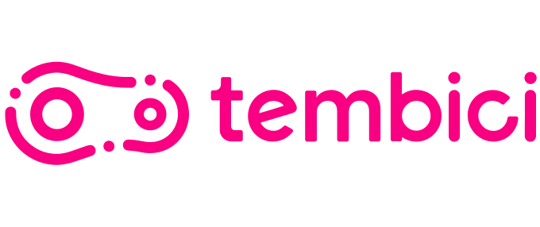

# Início
{ width="300" }
*Imagem 1: Logo tembici*

## Versionamento do projeto
| Versão | Data | Modificação | Autor |
|-|-|:-:|:-:|
|1.0| 05/02 | Criação da wiki | Gabriel Sabanai |
|2.0| 06/02 | Pré-Rastreabilidade, planejamento e apresentação 1 | Luiz Henrique, Victor Eduardo, Livia Rodriges, João Victor |
|3.0| 20/02 | Correções 1ª entrega, metodologias, outros repositórios, elicitação e priorização de requisitos, e apresentação 2 | Luiz Henrique, Victor Eduardo, Livia Rodriges, João Victor  |

Repositório da disciplina de Requisitos de Software 2021.2 realizado sobre a aplicação Tembici. Este repositório reúne artefatos de requisitos de software levantados a partir da aplicação mobile do Tembici.

## Por que o Tembici?

O Tembici é um aplicativo móbile desenvolvido  visando facilitar a mobilidade urbana. O serviço base do aplicativo é o aluguel de bicicletas para a locomoção na cidade,  sendo utilizado como objetivo de estudo visando a aplicação conteúdo ministrado na disciplina de Requisitos de Software. A escolha do aplicativo, dentre outros fatores, foi devido ao seu enfoque na melhoria de qualidade de vida da comunidade.

## Tembici em outros repositórios

Até o dia de hoje, 8 de fevereiro de 2020, não existem repositórios públicos que visam documentar o aplicativo Tembici. Por enquanto, todos os respositórios existentes relacionados a aplicação são desafios de implementação de funcionalidades no back-end, ou criação de clones da plataforma pelo front-end ou, então, por fim com o intuito de divulgar vagas para desenvolvedores.

Dessa forma, não existe nenhum repositório, que visa documentar o sistema, no qual a nossa equipe conseguiria se basear ou retirar informações que possam prejudicar a aplicação do aprendizado da disciplina.

## Equipe

| Foto                                                  | Nome                   | Email                            | GitHub                                              |
| ----------------------------------------------------- | ---------------------- | -------------------------------- | --------------------------------------------------- |
| {width="80"}       | Gabriel Sabanai        | gabrielsabanaitrindade@gmail.com | [@Sabanai104](https://github.com/Sabanai104)           |
| {width="80"}             | Luiz Henrique          | luizhemrique.fnandes@gmail.com            | [@luiz-herique](https://github.com/luiz-herique)       |
| {width="80"}       | João Victor Batista   | jvtexbat@hotmail.com             | [@jvBatista](https://github.com/jvBatista)                                         |
| {width="80"}           | Paulo Henrique Rezende | ph.hr.001@gmail.com              | [@phRezende-eng](https://github.com/PhRezende-eng)     |
| {width="80"}          | Lívia Rodrigues       | liviarodriguesre@gmail.com       | [@Liviarodrigues1](https://github.com/Liviarodrigues1) |
| {width="80"} | Victor Eduardo         | victorear05@gmail.com            | [@victorear05](https://github.com/victorear05)         |

## Referências

App tembici: sobre nós. Disponível em: <https://www.tembici.com.br/sobre-nos/>. Acesso em: 16 de fevereiro de 2022.
