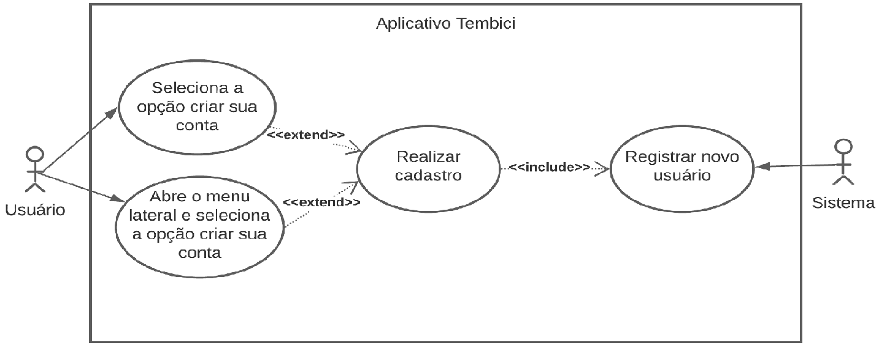
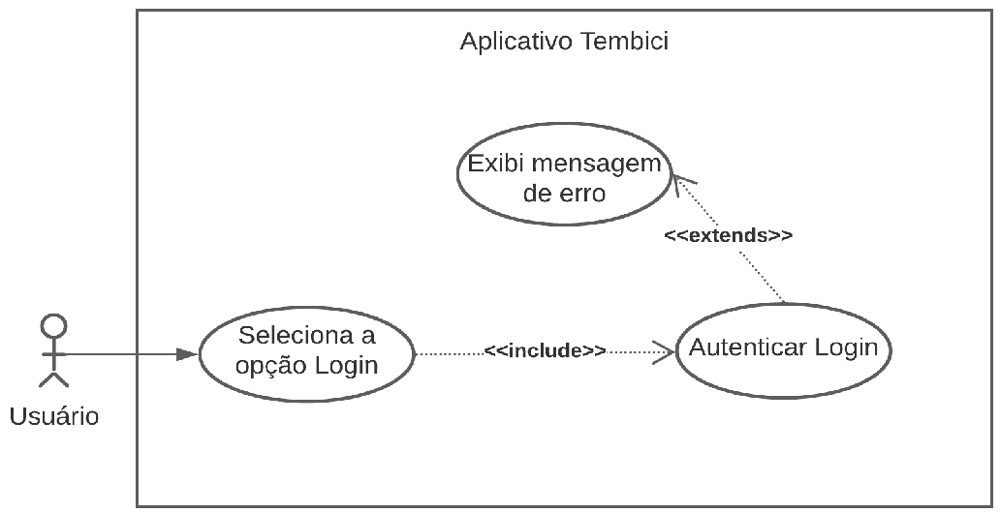
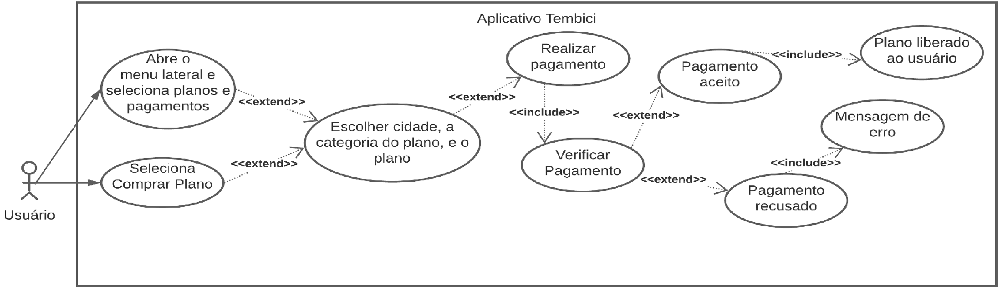
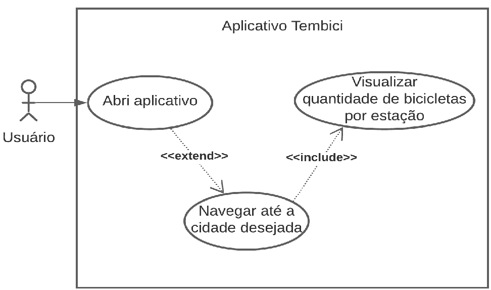
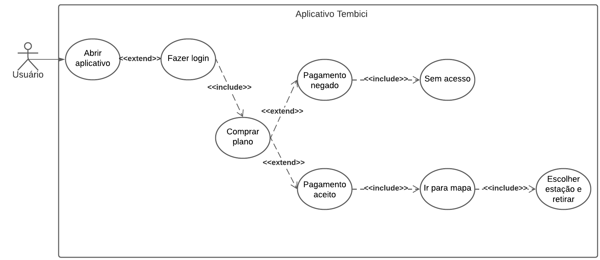
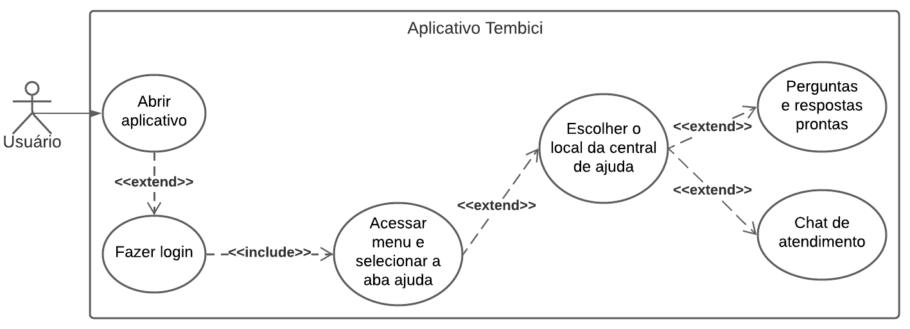
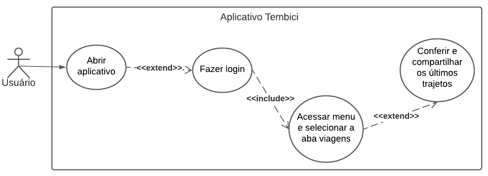

## Versionamento

| Versão | Data | Modificação | Autor |
|-|-|-|-|
| 1.0 | 12/02 | Criação da seção Casos de Uso e template | Victor Eduardo |
| 1.1 | 25/02 | Adição dos casos de Uso 1 a 4 | Victor Eduardo |
| 1.2 | 26/02 | Adição dos casos de Uso 5 a 8 | Lívia Rodrigues |

*Tabela 1: Versionamento*

# Casos de Uso
## Introdução

&emsp;&emsp;Também chamados de diagramas comportamentais, na notação da UML, os casos de uso são usados para descrever um conjunto de ações (uses cases - casos de uso) que um sistema ou um conjunto de sistemas (subject - sujeito) deve desempenhar em colaboração com um ou mais indivíduos externos ao sistema (actors - atores). Cada caso de uso deverá prover algum resultado observável e de valor para os atores ou outros interessados do sistema.

## Metodologia

&emsp;&emsp;Para cada caso de uso é colocado um diagrama feito no site Lucidchart, e uma tabela descrevendo o diagrama, sendo composta de:

| Item | Sigla | Definição |
| :-- | :-------------------- | :------------------------------------------------------------------------------------------------- |
| 1   | Versão                | Versão do caso de uso                                                                              |
| 2   | Autor                 | Nomes dos autores envolvidos nessa descrição de caso                                               |
| 3   | Descrição             | Breve descrição do caso de uso                                                                     |
| 4   | Atores                | Lista dos atores envolvidos no caso de uso                                                         |
| 5   | Pré-condições         | Todas as restrições que devem ser atendidas antes que o caso de uso possa iniciar sua execução     |
| 6   | Pós-condições         | Lista do estado em que o sistemas se encontrará imediatamente após a execução do cenário principal |
| 7   | Cenários Principais   | Descrição do cenário, ou fluxo, principal do caso de uso                                           |
| 8   | Cenários alternativos | Descrição dos cenários, ou fluxos, alternativos do caso de uso                                     |
| 9   | Cenários de exceção   | Descrição dos cenários, ou fluxos, de exceção do caso de uso                                       |

## Casos de Uso e Especificações
### 1 - Caso de Uso: Fazer cadastro

*Imagem 1: Diagrama 1*

| Item | Sigla | Definição |
| :-- | :-------------------- | :----------------------------------------------------------------------------------------- |
| 1   | Versão                | 1.0                                                                                        |
| 2   | Autor                 | Victor Eduardo                                                                             |
| 3   | Descrição             | O usuário deverá conseguir fazer cadastro de sua conta                                     |
| 4   | Atores                | Usuário                                                                                    |
| 5   | Pré-condições         | Dispositivo do usuário ter conexão com a internet, usuário estar com o aplicativo aberto   |
| 6   | Pós-condições         | Usuário estar devidamente cadastrado no sistema com sua conta                              |
| 7   | Cenários Principais   | Usuário selecionar a opção fazer criar conta                                               |
| 8   | Cenários alternativos | Usuário abrir a aba lateral e selecionar a opção fazer cadastro                            |    
| 9   | Cenários de exceção   | Usuário preencher algum dos campos de forma inválida ou não preencher um campo obrigatório | 

*Tabela 2: Caso de Uso 1*

### 2 - Caso de Uso: Fazer login

*Imagem 2: Diagrama 2*

| Item | Sigla | Definição |
| :-- | :-------------------- | :------------------------------------------------------------------------------------------------------------- |
| 1   | Versão                | 1.0                                                                                                            |
| 2   | Autor                 | Victor Eduardo                                                                                                 |
| 3   | Descrição             | O usuário deverá conseguir logar em sua conta                                                                  |
| 4   | Atores                | Usuário                                                                                                        |
| 5   | Pré-condições         | Dispositivo do usuário ter conexão com a internet, usuário estar com o aplicativo aberto                       |
| 6   | Pós-condições         | Usuário estar logado no sistema com sua conta                                                                  |
| 7   | Cenários Principais   | Usuário selecionar a opção fazer login                                                                         |
| 8   | Cenários alternativos | Usuário abrir a aba lateral e selecionar a opção fazer login                                                   |
| 9   | Cenários de exceção   | Usuário digitar a senha ou e-mail errados                                                                      | 

*Tabela 3: Caso de Uso 2*

### 3 - Caso de Uso: Assinar plano

*Imagem 3: Diagrama 3*

| Item | Sigla | Definição |
| :-- | :-------------------- | :------------------------------------------------------------------------------------------------------------------------------------------------ |
| 1   | Versão                | 1.0                                                                                                                                               |
| 2   | Autor                 | Victor Eduardo                                                                                                                                    |
| 3   | Descrição             | O usuário deverá conseguir assinar um dos planos disponíveis                                                                                      |
| 4   | Atores                | Usuário                                                                                                                                           |
| 5   | Pré-condições         | Dispositivo do usuário ter conexão com a internet e estar logado em sua conta                                                                     |
| 6   | Pós-condições         | Usuário ter assinado um plano e poder retirar uma bicicleta                                                                                       |
| 7   | Cenários Principais   | Usuário selecionar a opção comprar plano, selecionar a cidade, a categoria do plano e o plano desejado, e realizar pagamento                      |
| 8   | Cenários alternativos | Usuário abrir a aba lateral, selecionar a opção comprar plano, selecionar a cidade, a categoria do plano e o plano desejado, e realizar pagamento |
| 9   | Cenários de exceção   | Pagamento ser recusado                                                                                                                            | 

*Tabela 4: Caso de Uso 3*

### 4 - Caso de Uso: Ver mapa com as estações

*Imagem 4: Diagrama 4*

| Item | Sigla | Definição |
| :-- | :-------------------- | :------------------------------------------------------------------------------------------------------------- |
| 1   | Versão                | 1.0                                                                                                            |
| 2   | Autor                 | Victor Eduardo                                                                                                 |
| 3   | Descrição             | O usuário deverá conseguir ver o mapa com as estações e bicicletas disponíveis em cada uma                     |
| 4   | Atores                | Usuário                                                                                                        |
| 5   | Pré-condições         | Dispositivo do usuário ter conexão com a internet, usuário estar com o aplicativo aberto                       |
| 6   | Pós-condições         | Usuário visualizar as bicicletas disponíveis em cada estação na localiação desejada                            |
| 7   | Cenários Principais   | Usuário navegar até a localização desejada                                                                     |
| 8   | Cenários alternativos | -                                                                                                              |
| 9   | Cenários de exceção   | Mapa estar indisponível                                                                                        |

*Tabela 5: Caso de uso 4*

### 5 - Caso de Uso: Realizar viagem e devolução

*Imagem 5: Diagrama 5*

| Item | Sigla | Definição |
| :-- | :-------------------- | :--------------------------------------------------------------------------------------------------------------------------------------------- |
| 1   | Versão                | 1.0                                                                                                                                            |
| 2   | Autor                 | Lívia Rodrigues                                                                                                                                |
| 3   | Descrição             | O usuário deverá conseguir assinar o plano e retirar a bicicleta para realizar uma viagem e devolver no final do trajeto de acordo com a quantidade de vagas disponível em cada ponto                                                      |
| 4   | Atores                | Usuário                                                                                                                                        |
| 5   | Pré-condições         | O usuário ter feito cadastro, login e assinado um plano                                                                                        |
| 6   | Pós-condições         | Usuário retirar bicicleta para viagem e devolver antes do tempo máximo escolhido pelo usuário no plano                                                                                                        |
| 7   | Cenários Principais   | Usuário escolher cidade que deseja pedalar e retirar bicicleta na estação desejada, gerando um código no aplicativo (inserindo na estação ao lado esquerdo da bicicleta) ou escaneando o código QR Code (encontrado no guidão da bicicleta ou debaixo do banco), e devolvendo após o trajeto de acordo com a quantidade de vagas disponível em cada ponto, visualizando o tempo de posse da bicicleta no aplicativo, passado do tempo limite o usuário será cobrado de acordo com o seu plano                                                                     |
| 8   | Cenários alternativos | Usuário retirar a bicicleta em uma estação e devolver em outra; Usuário passar do tempo limite do seu plano e pagar multa de acordo com o plano escolhido; Usuário fazer viagens extras e ser cobrado por elas                                                                                |
| 9   | Cenários de exceção   | A compra não ter sido aprovada                                                                                                                 |

*Tabela 6: Caso de uso 5*

### 6 - Caso de Uso: Aba ajuda

*Imagem 6: Diagrama 6*

| Item | Sigla | Definição |
| :-- | :-------------------- | :----------------------------------------------------------------------------------------------------------------------------------- |
| 1   | Versão                | 1.0                                                                                                                                  |
| 2   | Autor                 | Lívia Rodrigues                                                                                                                      |
| 3   | Descrição             | O usuário deverá conseguir acessar a opção ajuda do menu para se informar e tirar dúvidas                                            |
| 4   | Atores                | Usuário                                                                                                                              |
| 5   | Pré-condições         | O usuário ter cadastro no aplicativo e fazer login                                                                                   |
| 6   | Pós-condições         | Usuário acessar a aba ajuda                                                                                                          |
| 7   | Cenários Principais   | Usuário conseguir acessar a aba ajuda para descobrir como o aplicativo funciona, cessar dúvidas sobre a conta, planos, pagamentos, desloqueio/devolução e viagens                                                                                                                                       |
| 8   | Cenários alternativos |         Existe a opção do chat e falar com um atendente de acordo com a região escolhida pelo usuário                                                                                                |
| 9   | Cenários de exceção   | Usuário não ter feito login                                                                                                          |

*Tabela 7: Caso de uso 6*

### 7 - Caso de Uso: Visualizar histórico de viagem

*Imagem 7: Diagrama 7*

| Item | Sigla | Definição |
| :-- | :-------------------- | :-------------------------------------------------------------------------------------------------------------------------------- |
| 1   | Versão                | 1.0                                                                                                                               |
| 2   | Autor                 | Lívia Rodrigues                                                                                                                   |
| 3   | Descrição             | O usuário deverá conseguir acessar a aba viagens do menu para visualizar o seus trajetos feitos, o seu histórico de viagem        |
| 4   | Atores                | Usuário                                                                                                                           |
| 5   | Pré-condições         | O usuário fazer login e já ter feito algum trajeto                                                                                |
| 6   | Pós-condições         | Usuário acessar a aba viagem e conferir seus trajetos                                                                             |
| 7   | Cenários Principais   | Usuário     conseguir visualizar todos os seus trajetos pelo aplicativo                                                           |
| 8   | Cenários alternativos |  -                                                                                                                                |
| 9   | Cenários de exceção   | Usuário não ter feito nenhuma viagem ainda                                                                                        |

## Referências Bibliográficas
- POHL, Klaus; RUPP, Chris. Fundamentos da Engenharia de Requisitos. Massachusetts: Rockynoock, 2012. (Páginas 92 - 98)
- Tutorial de Caso de Uso UML, Lucidchart Português, Youtube, Disponível em: https://www.youtube.com/watch?v=ab6eDdwS3rA&ab_channel=LucidchartPortugu%C3%AAs, Acesso em 25/02/2022
