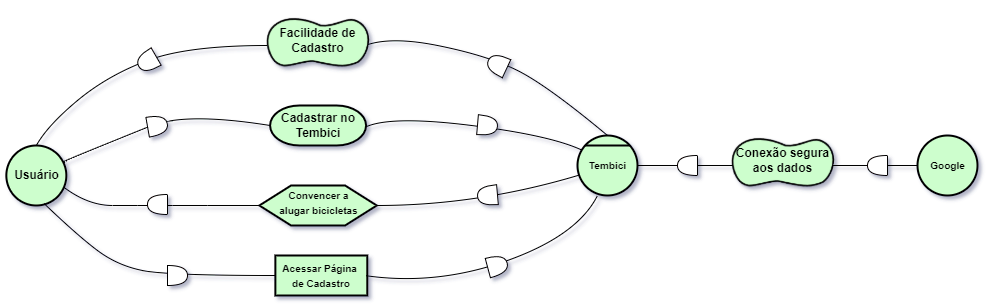
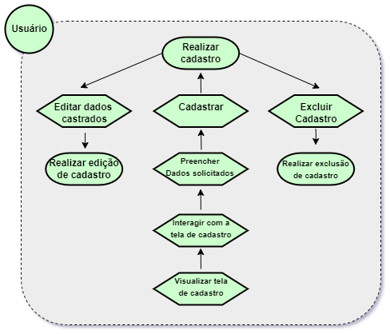
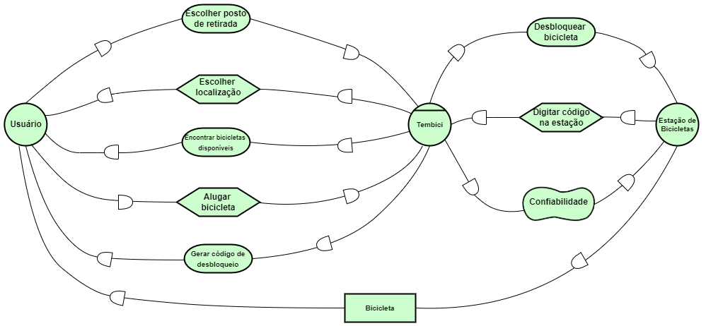
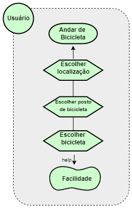
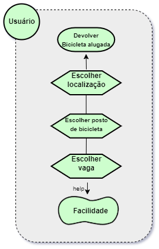

# iStar
## Versionamento

| Versão | Data | Modificação | Autor |
|-|-|:-:|:-:|
| 1.0 | 03/03/2022 | Criação Istar | Luiz Henrique |

*Tabela 1: versionamento*

## Introdução

&emsp;&emsp;A técnica iStar da etapa de Modelagem tem como objetivo o suporte à definição e especificação de elementos que compreenderão o produto final. A modelagem traz uma orientação voltada a objetivo e atores para o projeto, sendo dois elementos extremamente focalizados dentro da técnica. Sendo assim, o iStar consegue detalhar e melhorar a visualização do contexto e/ou problema em estudo, correlacionando atores, problemas, objetivos e soluções.

## Metodologia
 

&emsp;&emsp;Foram desenvolvidos para o projeto seis diagramas utilizando o software  Draw.io que detalham e analisam contextos da aplicação, sendo eles: Cadastro, Alugar Bicicleta e Devolver Bicicleta. A seguir podemos analisar cada um desses diagramas envolvendo tanto o Modelo de Dependência quanto o Modelo Rationale para cada contexto analisado.

## Resultados

### Cadastro

#### Modelo Depêndencia

*Imagem 1: Cadasttro - Modelo Depêndencia*

#### Modelo Rationale

*Imagem 2: Cadastro - Modelo Rationale*

### Alugar bicicleta

#### Modelo Depêndencia

*Imagem 3: Alugar bicicleta - Modelo Depêndencia*

#### Modelo Rationale

*Imagem 4: Alugar bicicleta - Modelo Rationale*

### Devolver bicicleta

#### Modelo Depêndencia

*Imagem 5: Devolver bicicleta - Modelo Depêndencia*

#### Modelo Rationale

*Imagem 6: Devolver bicicleta - Modelo Rationale*

## Referências 
- 
 Sanderson. iStar4G: Estendendo a linguagem iStar 2.0 para modelagem de jogos digitais. Disponível em: http://r1.ufrrj.br/nuesgames/Sanderson.pdf. Acesso em: Acesso em: 04 de Março de 2022. 

- 
 iStar Language Guide. Disponível em: iStar Language Guide. Acesso em: 04 de Março de 2022 

