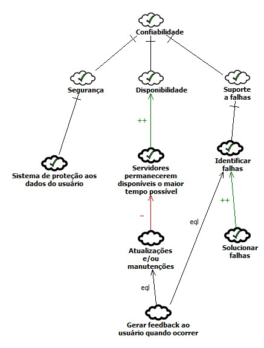
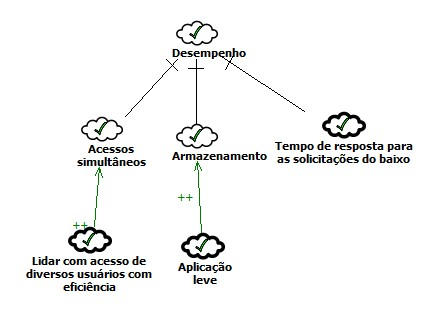

# NFR Framework 
## Versionamento

| Versão | Data | Modificação | Autor |
|-|-|:-:|:-:|
| 1.0 | 28/02/2022 | Criação do artefato | Victor Eduardo, Luiz Henrique |
| 1.1 | 03/03/2022 | Padronização | Luiz Henrique |
| 1.2 | 06/03/2022 | Revisão | João Victor, Luiz Henrique |
| 1.3 | 06/03/2022 | Adição revisor | Luiz Henrique |
| 1.4 | 09/04/2022 | Padronização de Legendas e Metodologias | Victor Eduardo |
| 1.5 | 21/04/2022 | Revisão | Lívia Rodrigues |

*Tabela 1: versionamento*

## Introdução

&emsp;&emsp;Este framework é utilizado neste trabalho para representar os Requisitos Não-Funcionais presentes no Catálogo NFR4Es, onde estes Requisitos Não-Funcionais serão expressados através de um grafo SIG. O NFR framework criado por (CHUNG et al., 2000), foi adotado por propor uma abordagem específica para o tratamento de Requisitos Não-Funcionais e fornecer uma rica representação para expressar esses requisitos, além de suas relações e correlações.

## Metodologia

&emsp;&emsp;Essa técnica de modelagem trata de decompor os requisitos não funcionais a niveis operacionais, facilitando a compreensão, priorização e garantindo que as expectativas dos stakeholders sejam atendidas. Cada tema de diagrama NFR elaborado nesse documento foi retirado dos requisitos não funcionais levantados na <a href="https://requisitos-de-software.github.io/2021.2-Tembici/modelagem/especificacao_suplementar/">especificação suplementar</a>.

Os tipos de contribuição utilizados nos diagramas foram:

- AND: Caso os softgoals descendentes sejam satisfeitos, serão também os ascendentes.
- OR: Caso algum softgoal descendentes seja satisfeitos, será também os ascendente.
- MAKE (++): Caso o softgoal descendente for suficientemente satisfeito, será também o ascendente, porém, a contribuição é fornecida como suficientemente positiva concebida no nível mais alto de satisfação.
- HELP (+): Caso o softgoal descendente seja parcialmente satisfeito, será parcialmente satisfeito o ascendente.
- HURT (-): Caso o softgoal descendente seja satisfeito, o softgoal ascendente será parcialmente negado.

Os rótulos utilizados foram:

| Rótulo | Descrição |
|   -    |     -     |
| {width="100"} |  Satisfeito | {justify-self="center"}
| {width="100"} |  Negado |
|  |  Parcialmente Satisfeito |
|  |  Parcialmente Negado |

*Tabela 2: Rótulos - NFR Framework* 

*Autor: Reinaldo Antônio da Silva*

&emsp;&emsp;Os diagrmas do mesmo foram desenvolvidos pelos integrantes Luiz Henrique e Victor Eduardo sendo validado com o demais membros da equipe por meio de uma reunião virtual no dia 1 de Março de 2022.

## Resultados
### Gráfico de Interdependência de Softgoal (SIG)
#### Usabilidade 
 
*Imagem 1: NFR Usabilidade* 

*Autor: Elaboração dos autores do presente documento*

#### Usabilidade Propagação
 
*Imagem 2: NFR Usabilidade Propagação* 

*Autor: Elaboração dos autores do presente documento*

#### Confiabilidade
 
*Imagem 3: NFR Confiabilidade* 

*Autor: Luiz Henrique e Victor Eduardo* 

#### Confiabilidade Propagação
 
*Imagem 4: NFR Confiabilidade Propagação* 

*Autor: Luiz Henrique e Victor Eduardo* 

#### Desempenho
 
*Imagem 5: NFR Desempenho*  

*Autor: Luiz Henrique e Victor Eduardo* 

#### Desempenho Propagação
 
*Imagem 6: NFR Desempenho Propagação*  

*Autor: Luiz Henrique e Victor Eduardo* 

#### Suportabilidade
 
*Imagem 7: NFR Suportabilidade*  

*Autor: Luiz Henrique e Victor Eduardo* 

#### Suportabilidade Propagação
 
*Imagem 8: NFR Suportabilidade Propagação* 

*Autor: Luiz Henrique e Victor Eduardo* 

## Referências 
- 
SILVA, Reinaldo Antônio da. NFR4ES: Um Catálogo de Requisitos Não-Funcionais para Sistemas Embarcados. Universidade Federal de Pernambuco, Recife, 2019. 2.4 - NFR Framework. Acesso em 01 de Março de 2022.

- 
PARADKAR, Mastering Non-Functional Requirements. Universidade Federal de Pernambuco, Recife, 2017. Acesso em 20 de Março de 2022.

