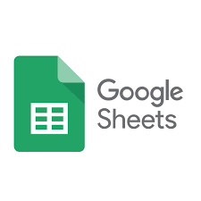

# Versionamento

| Versão | Data | Modificação | Autor |
|-|-|-|-|
| 1.0 | 02/02 | Criação do planejamento de trabalho | Todos os integrantes |
|1.1| 04/02 |
Adição das ferramentas do projeto
|
Paulo Henrique
|
|1.2| 04/02 |
Adição do cronograma do projeto
|
João Victor Batista
|

# Introdução 

A etapa de planejamento consiste em preparar, organizar e estruturar o projeto. É essencial para que decisões importantes sejam tomadas e com que as tarefas sejam executadas com excelência. Assim sendo, a etapa de planejamento serve, principalmente, para auxiliar a equipe na organização de suas tarefas e durante as decisões importantes que vão ter que ser executadas ao longo do projeto, seguindo as datas que foram definidas.

# Ferramentas utilizadas

||Ferramenta|Finalidade|
|:-:|:-:|-|
| {width="80"}| Github | Versionamento do projeto. |
| {width="80"}|  Telegram | Comunicação por texto entre os integrantes. |
| {width="80"} | Google Meets | Reunião e da equipe. |
| {width="80"}| Google Forms | Elicitar requisitos. |
| {width="80"}| Google Sheets | Analisar horários que o time estará disponível. |
| {width="80"}| Miro | Criação de diagramas e kanban da entrega dos artefatos. |
| {width="80"}| Visual Studio Code | Ferramenta usada ara edição dos documentos. |
| {width="80"}| Tembici App | Tema a ser analisado. |
<h6 align = "center">Tabela 2: Tabela contendo as ferramentas utilizadas no projeto</h6>
<h6 align = "center">Fonte: Autor</h6>

# Cronograma
{width="1000"}