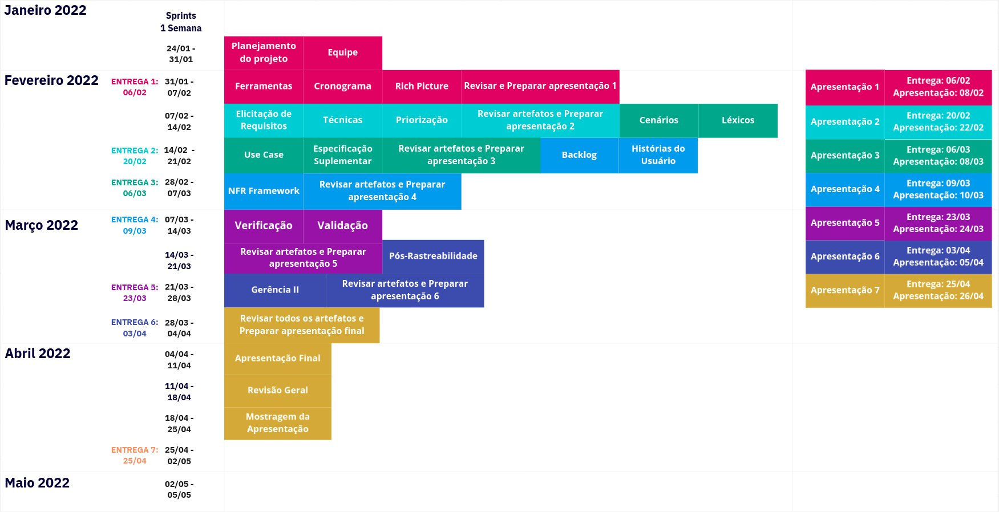

# Cronograma
## Versionamento

| Versão | Data | Modificação | Autor |
|-|-|:-:|:-:|
| 1.0 | 02/02 | Criação do cronograma | Victor Eduardo, Lívia Rodrigues |
| 1.1 | 02/02 | Criação do planejamento de trabalho | Gabriel Sabanai, João Victor, Lívia Rodrigues, Luiz Henrique, Paulo Henrique, Victor Eduardo |
| 1.2 | 02/02 | Adição do planejamento de trabalho | Gabriel Sabanai |
| 1.3 | 04/02 | Adição do cronograma do projeto | João Victor Batista |
| 1.4 | 24/02 | Padronização da página | Victor Eduardo |

*Tabela 1: versionamento*

## Introdução

&emsp;&emsp; O cronograma visa organizar de maneira sistematica em sprints ao longo do periodo do projeto as atividades que serão realizadas ao longo da disciplina, o  mesmo foi baseando no cronogrma de entregas das atividades do plano de ensino da disciplina Requisitos de Software, o mesmo está sujeito a autorações e acressimos caso necessário. 

## Datas e Sprints

*Imagem 1: Cronograma das atividades*

## Divisão de Tarefas

| Tarefa | Data | Responsáveis |
| ------ | ---- | ------------ |
| Planejamento do projeto | 24/01 - 31/01 | Gabriel Sabanai, Paulo Henrique, João Victor Batista, Victor Eduardo, Luiz Henrique, Lívia Rodrigues |
| Equipe | 24/01 - 31/01 | Gabriel Sabanai |
| Cronograma | 24/01 - 31/01 | Victor Eduardo, Lívia Rodrigues |
| Ferramentas | 31/01 - 07/02 |  Paulo Henrique |
| Rich Picture Inicial | 31/01 - 07/02 | João Victor Batista |
| Revisar e preparar apresentação 1 | 24/01 - 31/01 | Gabriel Sabanai, Paulo Henrique, João Victor Batista, Victor Eduardo, Luiz Henrique, Lívia Rodrigues |
| Definição de personas | 07/02 - 14/02 | João Victor Batista, Lívia Rodrigues |
| Brainstorm | 07/02 - 14/02 | Gabriel Sabanai, Luiz Henrique |
| Questionário | 07/02 - 14/02 | Paulo Henrique, Victor Eduardo |
| Definição de técnicas | 07/02 - 14/02 | Gabriel Sabanai, Paulo Henrique, João Victor Batista, Victor Eduardo, Luiz Henrique, Lívia Rodrigues |
| Priorização | 07/02 - 14/02 | Gabriel Sabanai, Paulo Henrique, João Victor Batista, Victor Eduardo, Luiz Henrique, Lívia Rodrigues |
| Revisar artefatos e preparar apresentação 2 | 07/02 - 14/02 | Gabriel Sabanai, Paulo Henrique, João Victor Batista, Victor Eduardo, Luiz Henrique, Lívia Rodrigues |
| Elicitação de Requisitos | 07/02 - 14/02 | Gabriel Sabanai, Paulo Henrique, João Victor Batista, Victor Eduardo, Luiz Henrique, Lívia Rodrigues |
| Cenários | 07/02 - 14/02 | Gabriel Sabanai, João Victor Batista |
| Léxicos | 07/02 - 14/02 | Paulo Henrique, Luiz Henrique |
| Diagrama de casos de Uso | 14/02 - 21/02 |  Victor Eduardo, Lívia Rodrigues |
| Especificação Suplementar | 14/02 - 21/02 |  Victor Eduardo |
| Revisar artefatos e preparar apresentação 3 | 14/02 - 21/02 | Gabriel Sabanai, Paulo Henrique, João Victor Batista, Victor Eduardo, Luiz Henrique, Lívia Rodrigues |
| Backlog | 28/02 - 07/03 | Gabriel Sabanai, Paulo Henrique |
| Histórias do usuário | 28/02 - 07/03 | João Victor Batista, Lívia Rodrigues |
| NFR framework | 28/02 - 07/03 | Victor Eduardo, Luiz Henrique |
| Istar | 28/02 - 07/03 | Victor Eduardo, Luiz Henrique |
| Revisar artefatos e preparar apresentação 4 | 28/02 - 07/03 | Gabriel Sabanai, Paulo Henrique, João Victor Batista, Victor Eduardo, Luiz Henrique, Lívia Rodrigues |
| Verificação | 07/03 - 14/03 | Gabriel Sabanai, Paulo Henrique, João Victor Batista, Victor Eduardo, Luiz Henrique, Lívia Rodrigues |
| Validação | 07/03 - 14/03 | Gabriel Sabanai, Paulo Henrique, João Victor Batista, Victor Eduardo, Luiz Henrique, Lívia Rodrigues |
| Revisar artefatos e preparar apresentação 5 | 14/03 - 21/03 | Gabriel Sabanai, Paulo Henrique, João Victor Batista, Victor Eduardo, Luiz Henrique, Lívia Rodrigues |
| Pós-rastreabilidade | 14/03 - 21/03 | Gabriel Sabanai, Paulo Henrique, João Victor Batista, Victor Eduardo, Luiz Henrique, Lívia Rodrigues |
| Gerência II | 21/03 - 28/03 | Gabriel Sabanai, Paulo Henrique, João Victor Batista, Victor Eduardo, Luiz Henrique, Lívia Rodrigues |
| Revisar artefatos e preparar apresentação 6 | 21/03 - 28/03 | Gabriel Sabanai, Paulo Henrique, João Victor Batista, Victor Eduardo, Luiz Henrique, Lívia Rodrigues |
| Revisar artefatos e preparar apresentação final | 28/03 - 04/04 | Gabriel Sabanai, Paulo Henrique, João Victor Batista, Victor Eduardo, Luiz Henrique, Lívia Rodrigues |
| Apresentação final | 04/04 - 11/04 | Gabriel Sabanai, Paulo Henrique, João Victor Batista, Victor Eduardo, Luiz Henrique, Lívia Rodrigues |

*Tabela 2: Distribuição de atividades do projeto*

## Referências

 SALES, André. Plano de Ensino: Requisitos de Software 2021.2. Acesso em 03 de Março de 2022
