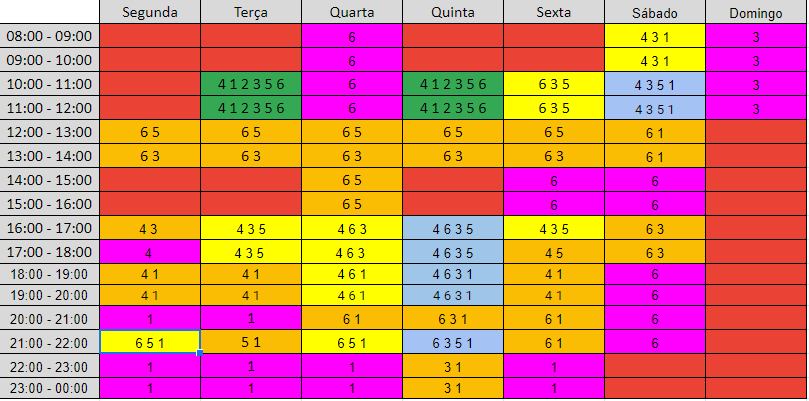

# Nome do Artefato 
## Versionamento

| Versão | Data | Modificação | Autor |
|-|-|:-:|:-:|
| 1.0 | 05/03/2022 | Criação Readmap  |  Livia Rodrigues, Luiz Henrique |
| 1.1 | 06/03/2022 | Revisão | Luiz Henrique  |

*Tabela 1: versionamento*

## Introdução

Para um melhor conhecimento da disponibilidade dos membros da equipe foi feito, por meio de readmap, o levantamento da disponibilidade de cada membro. O mapeamento foi realizado em blocos de 1 hora para facilitar o desenvolvimento geral do heatmap.

## Metodologia

O Readmap foi realizado utilizando o uma planilha no software web Google Planilhas, foi associado um numéro a cada membro da equipe para o preenchimento do readmap:

| Id | Nome | 
|:-:|:-:|
| 1 | Paulo |
| 2 | Gabriel |
| 3 | Luiz |
| 4 | Lívia |
| 5 | João |
| 6 | Victor |

*Tabela 1: Id membro*

As cores do readmap estão relacionados a quantidade de membros disponiveis no horário:

Cores

| Quantidade | Cores | 
|:-:|:-:|
| Nenhum membro | Vermelho |
| 1 membro | Rsoa |
| 2 membros | Laranja |
| 3 membros | Amarelo |
| 4 membros | Azul |
| 5 membros | Marrom |
| Todos os membros | Verde |

*Tabela 2: Significado cores*

## Resultados

*Imagem 1: Readmap de horários*

## Referências 

- 
LUDOS. TituloDescubra quais são os tipos de roadmap e como podem te ajudar. Disponível em: https://www.ludospro.com.br/blog/road-map. Acesso em 05 Março de 2022.
