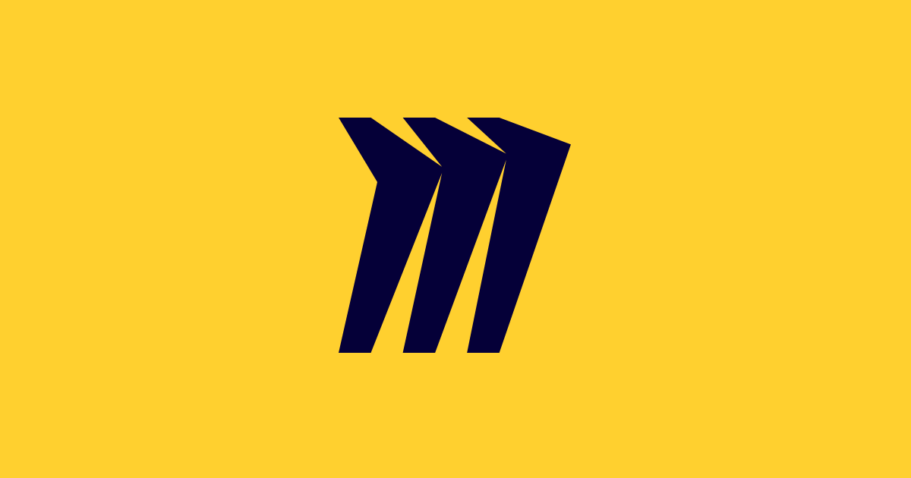

## 1. Versionamento

|Versão|Data|Descrição|Autor(es)|
|------|----|---------|---------|
|1.0|04/02|
Adição das ferramentas do projeto
|
Paulo Henrique
|

## 2. Ferramentas

||Ferramenta|Finalidade|
|:-:|:-:|-|
|  | Github | Versionamento do projeto. |
|  | Telegram | Comunicação por texto entre os integrantes. |
|  | Google Meats | Reunião e da equipe. |
|  | Google Forms | Elicitar requisitos. |
|  | Google Sheets | Analisar horários que o time estará disponível. |
|  | Miro | Criação de diagramas e kanban da entrega dos artefatos. |
|  | Visual Studio Code | Ferramenta usada ara edição dos documentos. |
|  | Tembici App | Tema a ser analisado. |
<h6 align = "center">Tabela 2: Tabela contendo as ferramentas utilizadas no projeto</h6>
<h6 align = "center">Fonte: Autor</h6>