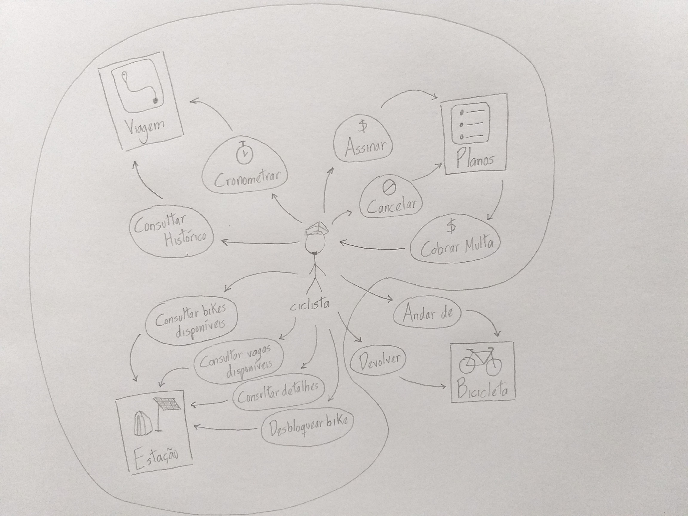

# Versionamento

| Versão | Data | Modificação | Autor |
|-|-|:-:|:-:|
| 1.0 | 04/02 |  Criação da Rich Picture 1.0 |  João Victor Batista |
| 2.0 | 16/02 |  Adição do 5W2H | Victor Eduardo e Luiz Henrique |
| 2.1 | 16/02 |  Adição das Referências | Victor Eduardo |

*Tabela versionamento*

# Rich Picture 1.0
{width="1000"}
*Rich Picture 1.0 img*

# 5W2H

&emsp;&emsp;O 5W2H é uma ferramenta que permite melhor gestão do projeto, com o principal intuito de esclarecer as principais dúvidas em relação ao projeto a partir de um checklist de atividades específicas que posteriormente deverão ser desenvolvidas. As perguntas a serem respondidas são: What (o que será feito ?) - Why (Por que será feito ?) - When (Quando será feito ? ) - Who (Por quem será feito) - How (Como será feito ?) - How much (quanto vai custar ?). E após coletar as informações sobre esse questionário terá um mapa de atividades que permitirão passos precisos e ordenados para desenvolver o projeto.  

| Pergunta | Resposta |
| :-------: | :------- |
| What: O que? | Um aplicativo será destinado a facilitação da mobilidade urbana através do aluguel e empréstimo de bicicletas em pontos estratégicos da cidade |
| Why: Porque está sendo feito? | Para que os usuários consigam ter hábitos mais saudáveis, já que com o uso das bicicletas disponibilizadas no app esse consegue se locomover para onde precisa, ou deseja, se exercitando no processo. Além disso, o app possibilita uma redução da poluição uma vez que quando um usuário migre do uso de veículos emissores de CO2 para o uso de bicicletas, a emissão de CO2 irá diminuir |
| Where: Onde? | Em postos de aluguel de bicicletas distribuídos de maneira estratégica em cidades pelo Brasil e pelo mundo: São Paulo, Rio de Janeiro, Salvador, Pernambuco, Porto Alegre, Santiago, Buenos Aires, Brasília, Vila Velha, Riviera |
| When: Quando? | Começou a ganhar popularidade a partir de 2014, porém o app foi criado em 2010. Ultimamente o app está ganhando mais popularidade por carregar a bandeira de propiciar um meio de locomoção sustentável |
| Who: Por quem será feito? | Foi construído pela equipe de desenvolvimento da empresa Tembici, fundada por Maurício Villar e Tomás Martins |
| How: Como foi feito? | Feito através da iniciativa privada de dois sócios, com rodadas de investimentos para bancar o projeto que é feito através da implantação de estações que possuem bicicletas disponíveis aos usuários do app |
| How much: Quanto? | Não há informações suficientes para inferir dados exatos. Mas em 2014 a empresa passava por uma situação financeira frágil até que o banco Itaú fechou um projeto com a empresa e serviu como o respiro que precisavam. Desde então a empresa obteve outras rodadas de investimentos, algumas até milionárias |
  
*Tabela 5W2H 1.0 img*  

## Referências

&emsp;&emsp;5w2h: hora de tirar as dúvidas e aumentar produtividade. Disponível em: https://endeavor.org.br/pessoas/5w2h/. Acesso em: 16 de fevereiro de 2022.

&emsp;&emsp;App tembici: sobre nós. Disponível em: https://www.tembici.com.br/sobre-nos/. Acesso em: 16 de fevereiro de 2022. 

&emsp;&emsp;Tembici: o sonho de popularizar a bicicleta como meio de transporte no mundo todo. Disponível em: https://endeavor.org.br/historia-de-empreendedores/tembici/. Acesso em: 16 de fevereiro de 2022.
